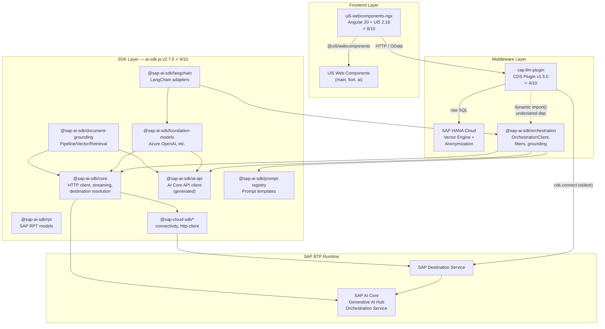
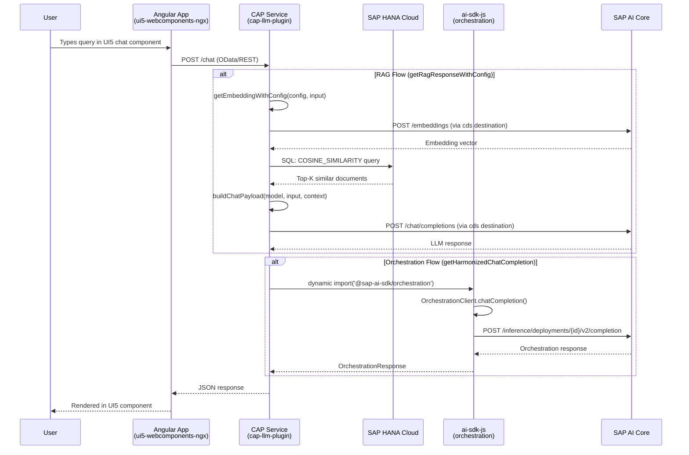
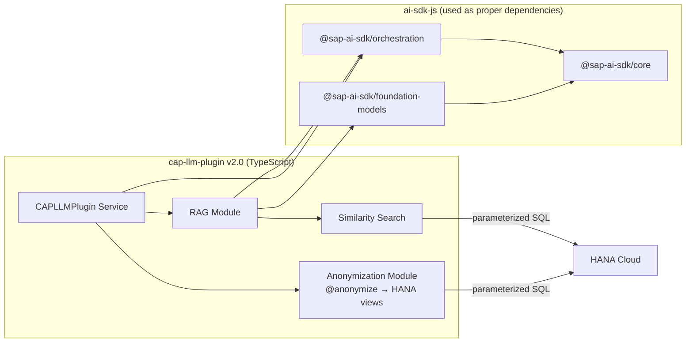
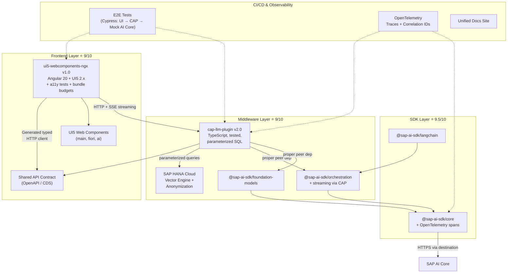

# SAP OSS Ecosystem: Architecture & Roadmap to 9/10

> A comprehensive architecture review and phased improvement plan for the SAP open-source JavaScript ecosystem: **ai-sdk-js**, **cap-llm-plugin**, and **ui5-webcomponents-ngx**.

**Date:** February 2026  
**Current Composite Score:** 7.0/10  
**Target Composite Score:** 9.0/10

---

## Table of Contents

1. [Executive Summary](#1-executive-summary)
2. [Current Architecture (As-Is)](#2-current-architecture-as-is)
3. [Per-Repo Deep Dive](#3-per-repo-deep-dive)
4. [Integration & Data Flow](#4-integration--data-flow)
5. [Gap Analysis](#5-gap-analysis)
6. [Roadmap to 9/10](#6-roadmap-to-910)
7. [Target Architecture (To-Be)](#7-target-architecture-to-be)
8. [Appendix](#8-appendix)

---

## 1. Executive Summary

Three SAP open-source repositories form a layered stack for building AI-powered enterprise Angular applications on SAP BTP:

| Repository | Role | Version | Current Rating |
|---|---|---|---|
| **ai-sdk-js** | AI/LLM SDK layer | 2.7.0 | 9/10 |
| **cap-llm-plugin** | CAP middleware for GenAI | 1.5.0 | 4/10 |
| **ui5-webcomponents-ngx** | Angular UI component library | 0.5.11-rc.5 | 8/10 |

The **ai-sdk-js** is production-grade with excellent engineering. The **ui5-webcomponents-ngx** is a mature code-generation project. The **cap-llm-plugin** is the weakest link with critical security issues, no tests, and fragile integration. The roadmap focuses primarily on hardening cap-llm-plugin while strengthening cross-repo integration contracts.

---

## 2. Current Architecture (As-Is)

### 2.1 System Overview Diagram



### 2.2 Dependency Map

#### Code-Level Dependencies

| From | To | Type | Declared? |
|---|---|---|---|
| `@sap-ai-sdk/orchestration` | `@sap-ai-sdk/core` | workspace dependency | ✅ |
| `@sap-ai-sdk/orchestration` | `@sap-ai-sdk/ai-api` | workspace dependency | ✅ |
| `@sap-ai-sdk/orchestration` | `@sap-ai-sdk/prompt-registry` | workspace dependency | ✅ |
| `@sap-ai-sdk/foundation-models` | `@sap-ai-sdk/core` | workspace dependency | ✅ |
| `@sap-ai-sdk/langchain` | `@sap-ai-sdk/orchestration` | workspace dependency | ✅ |
| `cap-llm-plugin` | `@sap-ai-sdk/orchestration` | **dynamic import()** | ❌ **Not declared** |
| `cap-llm-plugin` | `@sap/cds` | peer dependency | ✅ |
| `cap-llm-plugin` | `@sap/cds-hana` | peer dependency | ✅ |
| `@ui5/webcomponents-ngx` | `@ui5/webcomponents*` | peer dependency | ✅ |
| `@ui5/webcomponents-ngx` | `@angular/*` | peer dependency | ✅ |

#### Runtime Dependencies

| From | To | Protocol |
|---|---|---|
| Angular App (ui5-webcomponents-ngx) | CAP Backend (cap-llm-plugin) | HTTP / OData |
| CAP Backend | SAP Destination Service | BTP service binding |
| ai-sdk-js core | SAP AI Core | HTTPS via destination |
| cap-llm-plugin | SAP HANA Cloud | SQL via CDS DB |

---

## 3. Per-Repo Deep Dive

### 3.1 ai-sdk-js (9/10)

**Purpose:** Official SDK for SAP AI Core, Generative AI Hub, and Orchestration Service.

#### Architecture

- **Monorepo:** pnpm workspaces with 8 packages + 3 test packages + 2 sample apps
- **Language:** TypeScript (ESM-first with CJS dual build — see ADR-001)
- **Code generation:** OpenAPI specs → `@sap-cloud-sdk/openapi-generator` / `orval` → typed clients
- **API facade pattern:** ADR-004 mandates wrapped public types to isolate from generated API changes

#### Package Responsibilities

| Package | Responsibility | LOC (approx) |
|---|---|---|
| `core` | HTTP client, streaming (SSE), destination resolution, model types | ~600 |
| `ai-api` | Generated AI Core management API (deployments, scenarios, Docker registries) | ~35K (generated) |
| `orchestration` | `OrchestrationClient` — chat completion, streaming, content filtering, grounding, masking, translation | ~11K |
| `foundation-models` | Direct model clients (Azure OpenAI, etc.) | ~8K |
| `langchain` | LangChain `BaseChatModel` / `BaseEmbeddings` adapters | ~2K |
| `document-grounding` | Pipeline, Vector, and Retrieval API clients | ~5K |
| `prompt-registry` | Prompt template CRUD and versioning | ~3K |
| `rpt` | SAP RPT model support | ~1K |

#### Strengths

- **Comprehensive test pyramid:** unit tests per package, type tests (`tsd`), e2e tests against live AI Core, smoke tests
- **18 GitHub workflows:** build, e2e, smoke, CodeQL, Dependabot, canary publish, spec auto-update
- **Streaming support:** `SseStream`, `OrchestrationStream` with `AbortController`, proper backpressure
- **ADR-driven decisions:** ESM strategy, project structure, API facade
- **Changeset-based versioning:** automated release notes and npm publish pipeline

#### Minor Gaps

- ADR-002 (project structure) is incomplete — only lists 4 of 8 packages
- No performance benchmarks or load-testing infrastructure
- Error messages could be more actionable (e.g., deployment resolution failures)

---

### 3.2 cap-llm-plugin (4/10)

**Purpose:** CDS plugin for building GenAI CAP applications with HANA Cloud anonymization, vector search, and LLM access.

#### Architecture

- **Single package:** plain JavaScript, no build step
- **3 files total:**
  - `cds-plugin.js` (43 lines) — CDS lifecycle hook for `@anonymize` annotations
  - `srv/cap-llm-plugin.js` (744 lines) — `CAPLLMPlugin` service class
  - `lib/anonymization-helper.js` (43 lines) — HANA anonymized view creation

#### Class API

```
CAPLLMPlugin extends cds.Service
├── getAnonymizedData(entityName, sequenceIds)
├── getEmbedding(input)                          [DEPRECATED]
├── getEmbeddingWithConfig(config, input)
├── getChatCompletion(payload)                   [DEPRECATED]
├── getChatCompletionWithConfig(config, payload)
├── buildChatPayload(modelName, input, systemPrompt, context, chatParams)
├── similaritySearch(tableName, embeddingCol, contentCol, embedding, algo, topK)
├── getRagResponse(...)                          [DEPRECATED]
├── getRagResponseWithConfig(...)
├── getHarmonizedChatCompletion({clientConfig, chatCompletionConfig, ...})
└── getContentFilters({type, config})
```

#### Critical Issues

| Severity | Issue | Location |
|---|---|---|
| 🔴 **Critical** | SQL injection via string interpolation | `similaritySearch()` lines 644-645, `getAnonymizedData()` lines 43-45 |
| 🔴 **Critical** | No test suite at all | Entire repo |
| 🟠 **High** | Undeclared dependency on `@sap-ai-sdk/orchestration` | `getHarmonizedChatCompletion()` line 681, `getContentFilters()` line 719 |
| 🟠 **High** | Hardcoded model lists that must be manually maintained | `supportedModels` object, lines 5-10 |
| 🟡 **Medium** | No TypeScript — zero type safety | Entire codebase |
| 🟡 **Medium** | Deprecated methods without removal timeline | `getEmbedding`, `getChatCompletion`, `getRagResponse` |
| 🟡 **Medium** | Duplicated LLM access logic that ai-sdk-js already provides | `getEmbeddingWithConfig`, `getChatCompletionWithConfig` |
| 🟢 **Low** | Catch-and-rethrow anti-patterns | Multiple methods |
| 🟢 **Low** | Typos in code and docs | "doumentation", "sililarity", "retriving", "respostive" |

---

### 3.3 ui5-webcomponents-ngx (8/10)

**Purpose:** Angular wrapper for UI5 Web Components with full type safety, form integration, and theming.

#### Architecture

- **Nx monorepo:** yarn workspaces, Angular 20.x, UI5 2.18.x
- **Code generation pipeline:**

```
UI5 Web Components
    └── custom-elements-internal.json schemas
        └── @ui5/webcomponents-schema-parser (libs/ui5-schema-parser)
            └── ComponentData[]
                └── @ui5/webcomponents-transformer (libs/transformer)
                    └── @ui5/webcomponents-ngx-generator (libs/angular-generator)
                        └── Angular Directives, Modules, Theming Services
                            └── @ui5/webcomponents-ngx (libs/ui5-angular)
```

- **3 wrapper packages:** main, fiori, ai — each with auto-generated theming service
- **Apps:** Storybook documentation, interactive playground

#### Strengths

- Automated schema → directive generation ensures 1:1 parity with UI5
- Proper `ControlValueAccessor` for Angular Forms (`ngModel`, `formControlName`)
- Storybook 9.x + Cypress e2e
- Nx caching and build graph for efficient CI

#### Gaps

| Severity | Issue |
|---|---|
| 🟡 **Medium** | No accessibility (a11y) testing automation — relies on UI5's built-in a11y |
| 🟡 **Medium** | Heavy dev dependency tree (1MB+ yarn.lock), React pulled in for Storybook |
| 🟡 **Medium** | Pre-release version (0.5.11-rc.5) — not yet 1.0 stable |
| 🟢 **Low** | Generator debugging is complex — multi-stage pipeline |
| 🟢 **Low** | No explicit bundle-size tracking or budgets |

---

## 4. Integration & Data Flow

### 4.1 End-to-End Request Flow



### 4.2 Integration Quality Assessment

| Integration Point | Quality | Issue |
|---|---|---|
| **Angular → CAP** (HTTP) | ⚠️ Implicit | No shared OpenAPI/CDS contract, no generated client types |
| **CAP → HANA** (SQL) | 🔴 Unsafe | Raw string interpolation, no parameterized queries |
| **CAP → AI Core** (HTTP via destination) | ⚠️ Duplicated | cap-llm-plugin reimplements what ai-sdk-js already provides |
| **CAP → ai-sdk-js** (import) | 🔴 Fragile | Undeclared dynamic `import()`, only 2 of 11 methods use it |
| **ai-sdk-js internal** | ✅ Excellent | Clean workspace deps, shared core, consistent patterns |
| **ui5-webcomponents-ngx internal** | ✅ Excellent | Schema-driven generation, Nx build graph |

---

## 5. Gap Analysis

### 5.1 Cross-Cutting Gaps

| # | Gap | Impact | Repos Affected |
|---|---|---|---|
| G1 | No shared API contract between UI and CAP layers | Frontend and backend evolve independently with no type safety at the boundary | ui5-ngx, cap-llm |
| G2 | No end-to-end test pipeline | Cannot verify full stack (UI → CAP → AI Core) in CI | All three |
| G3 | Inconsistent error handling patterns | Errors are swallowed, re-thrown without context, or logged inconsistently | cap-llm (critical), ai-sdk-js (minor) |
| G4 | No observability standard | No OpenTelemetry, no structured logging, no correlation IDs | cap-llm, ui5-ngx |
| G5 | Inconsistent language/type safety | cap-llm-plugin is plain JS while all others are TypeScript | cap-llm |

### 5.2 Per-Repo Gap Summary

```
ai-sdk-js       ████████████████████░  9/10  — Minor: incomplete ADRs, no perf benchmarks
ui5-ngx          ████████████████░░░░  8/10  — Medium: no a11y tests, pre-release, heavy deps
cap-llm-plugin   ████████░░░░░░░░░░░░  4/10  — Critical: SQL injection, no tests, no types
```

---

## 6. Roadmap to 9/10

### Phase 1: Critical Fixes (cap-llm-plugin) — Target: 4 → 6/10

**Timeline:** 2–3 weeks  
**Focus:** Security, stability, and basic quality gates.

| # | Action | Details | Priority |
|---|---|---|---|
| 1.1 | **Fix SQL injection vulnerabilities** | Replace string interpolation in `similaritySearch()` and `getAnonymizedData()` with parameterized queries using `cds.run(query, params)` | 🔴 Critical |
| 1.2 | **Declare `@sap-ai-sdk/orchestration` as peer dependency** | Add to `package.json` peerDependencies; document installation requirement | 🔴 Critical |
| 1.3 | **Add unit test suite** | Create `tests/` directory with Jest; cover `similaritySearch`, `getEmbeddingWithConfig`, `getChatCompletionWithConfig`, `getRagResponseWithConfig`, `getHarmonizedChatCompletion` with mocked `cds.db` and destinations | 🟠 High |
| 1.4 | **Remove deprecated methods** | Remove `getEmbedding`, `getChatCompletion`, `getRagResponse` or move to a `legacy.js` export with a clear deprecation schedule | 🟠 High |
| 1.5 | **Fix typos and code quality** | Fix "doumentation" → "documentation", "sililarity" → "similarity", etc.; remove catch-and-rethrow anti-patterns | 🟡 Medium |
| 1.6 | **Add ESLint + Prettier** | Configure linting to match ai-sdk-js conventions | 🟡 Medium |

**Exit criteria:** All critical security issues resolved, ≥70% unit test coverage on core methods, CI pipeline running tests on every PR.

---

### Phase 2: TypeScript Migration & SDK Adoption (cap-llm-plugin) — Target: 6 → 8/10

**Timeline:** 4–6 weeks  
**Focus:** Type safety, SDK alignment, and eliminating duplication.

| # | Action | Details | Priority |
|---|---|---|---|
| 2.1 | **Migrate to TypeScript** | Add `tsconfig.json`, rename `.js` → `.ts`, add type annotations to all public methods; publish with `.d.ts` declarations | 🟠 High |
| 2.2 | **Replace raw HTTP calls with ai-sdk-js clients** | `getEmbeddingWithConfig` → use `@sap-ai-sdk/foundation-models` or `OrchestrationEmbeddingClient`; `getChatCompletionWithConfig` → use `@sap-ai-sdk/orchestration` `OrchestrationClient`; `buildChatPayload` → remove entirely (SDK handles payload construction) | 🟠 High |
| 2.3 | **Remove hardcoded `supportedModels` map** | Delegate model validation and routing to the SDK, which already handles this via AI Core deployments | 🟠 High |
| 2.4 | **Add integration tests** | Test against mocked AI Core endpoints; verify RAG pipeline end-to-end with test vectors and HANA simulator | 🟡 Medium |
| 2.5 | **Publish TypeScript types for plugin API** | Export `CAPLLMPluginConfig`, `EmbeddingConfig`, `ChatConfig`, `RagConfig` types so consumers get autocomplete and compile-time safety | 🟡 Medium |
| 2.6 | **Add JSDoc / TSDoc** | Document all public methods with proper param types, return types, and usage examples | 🟡 Medium |

**Resulting architecture of cap-llm-plugin after Phase 2:**



**Exit criteria:** Zero raw HTTP calls to AI Core — all go through ai-sdk-js. Full TypeScript with published types. ≥85% test coverage.

---

### Phase 3: Integration Hardening — Target: 8 → 9/10

**Timeline:** 4–6 weeks  
**Focus:** Cross-repo contracts, observability, and end-to-end confidence.

| # | Action | Details | Repos |
|---|---|---|---|
| 3.1 | **Define shared API contract** | Create an OpenAPI spec (or CDS service definition) for the CAP → Angular boundary; generate a typed Angular HTTP client from it | cap-llm, ui5-ngx |
| 3.2 | **Add end-to-end test pipeline** | Cypress tests in ui5-ngx that hit a CAP backend (with mocked AI Core); run in CI | All three |
| 3.3 | **Standardize error handling** | Define error response schema (`{ code, message, details }`) used across all layers; add error boundary in Angular, structured error responses in CAP | All three |
| 3.4 | **Add OpenTelemetry instrumentation** | Trace requests from Angular → CAP → AI Core with correlation IDs; instrument ai-sdk-js `executeRequest` with spans | cap-llm, ai-sdk-js |
| 3.5 | **Create cross-repo documentation site** | Unified docs site (e.g., Docusaurus) covering architecture, setup guides, API reference for all three projects | All three |
| 3.6 | **Add streaming support to cap-llm-plugin** | Leverage `OrchestrationClient.stream()` from ai-sdk-js; pipe SSE responses through CAP to Angular | cap-llm, ai-sdk-js |

**Exit criteria:** Typed API contract enforced in CI, e2e tests green, structured observability in place.

---

### Phase 4: Polish — Sustained 9/10

**Timeline:** Ongoing  
**Focus:** Performance, developer experience, and ecosystem maturity.

#### ai-sdk-js (9 → 9.5/10)

| # | Action |
|---|---|
| 4.1 | Complete ADR-002 to cover all 8 packages |
| 4.2 | Add performance benchmarks (chat completion latency, streaming throughput) |
| 4.3 | Improve error messages with actionable remediation suggestions |
| 4.4 | Add usage telemetry opt-in for SAP to understand adoption patterns |

#### ui5-webcomponents-ngx (8 → 9/10)

| # | Action |
|---|---|
| 4.5 | Add automated accessibility testing (axe-core in Cypress) |
| 4.6 | Track and enforce bundle-size budgets per Angular module |
| 4.7 | Reduce dev dependency footprint — evaluate Storybook alternatives to eliminate React dep |
| 4.8 | Reach 1.0 stable release with SemVer commitment |
| 4.9 | Add AI-specific component demos (chat panel, RAG result viewer) using `@ui5/webcomponents-ai` |

#### cap-llm-plugin (8 → 9/10)

| # | Action |
|---|---|
| 4.10 | Add CONTRIBUTING.md with clear development setup, testing, and PR guidelines |
| 4.11 | Add GitHub Actions CI (lint, test, publish) mirroring ai-sdk-js patterns |
| 4.12 | Add Changeset-based versioning |
| 4.13 | Create sample application demonstrating full stack (Angular + CAP + ai-sdk-js) |

---

## 7. Target Architecture (To-Be)

### 7.1 Target System Diagram



### 7.2 Target Rating Justification

| Repository | Current | Target | Key Improvements |
|---|---|---|---|
| **ai-sdk-js** | 9/10 | 9.5/10 | Complete ADRs, perf benchmarks, OTel instrumentation, better error messages |
| **cap-llm-plugin** | 4/10 | 9/10 | TypeScript, parameterized SQL, full SDK adoption, tests, streaming, CI/CD |
| **ui5-webcomponents-ngx** | 8/10 | 9/10 | a11y tests, bundle budgets, 1.0 release, AI component demos |
| **Integration** | 3/10 | 9/10 | Shared typed contract, e2e tests, OTel tracing, unified docs |
| **Composite** | **7.0/10** | **9.0/10** | |

### 7.3 Risk Register

| Risk | Probability | Impact | Mitigation |
|---|---|---|---|
| cap-llm-plugin TypeScript migration breaks existing consumers | Medium | High | Publish v2.0 with migration guide; maintain v1.x branch for 6 months |
| ai-sdk-js API changes break cap-llm-plugin | Low | High | Pin ai-sdk-js versions in peer deps; add integration tests in cap-llm-plugin CI |
| UI5 Web Components schema changes break Angular wrappers | Low | Medium | Already mitigated by code generation pipeline; add schema diff CI check |
| Performance regression from added OTel instrumentation | Low | Low | Benchmark before/after; use sampling |

---

## 8. Appendix

### 8.1 Technology Stack Summary

| Layer | Language | Framework | Build | Package Manager | Test |
|---|---|---|---|---|---|
| ai-sdk-js | TypeScript (ESM) | Node.js | tsc | pnpm | Jest, tsd, e2e |
| cap-llm-plugin | JavaScript (CJS) → **TypeScript** | SAP CDS | none → **tsc** | npm | none → **Jest** |
| ui5-webcomponents-ngx | TypeScript | Angular 20, Nx | ng-packagr | yarn | Jest, Cypress |

### 8.2 Key Files Reference

**ai-sdk-js:**
- Monorepo config: `pnpm-workspace.yaml`
- Core HTTP client: `packages/core/src/http-client.ts`
- Orchestration client: `packages/orchestration/src/orchestration-client.ts`
- ADRs: `adr/001-esm.md`, `adr/004-api-facade.md`
- Sample CAP app: `sample-cap/srv/orchestration/orchestration-service.ts`

**cap-llm-plugin:**
- CDS plugin entry: `cds-plugin.js`
- Main service: `srv/cap-llm-plugin.js`
- Anonymization helper: `lib/anonymization-helper.js`
- API docs: `docs/api-documentation.md`

**ui5-webcomponents-ngx:**
- Wrapper config: `libs/ui5-angular/wrapper.conf.ts`
- Published package: `libs/ui5-angular/package.json`
- Nx config: `nx.json`
- Schema parser: `libs/ui5-schema-parser/`
- Generator: `libs/angular-generator/`

### 8.3 Phase Timeline Overview

```
Week:  1  2  3  4  5  6  7  8  9  10 11 12 13 14 15 16+
       ├──Phase 1──┤
       │ SQL fix    │
       │ Tests      │
       │ Deps       │
                    ├─────Phase 2─────┤
                    │ TypeScript       │
                    │ SDK adoption     │
                    │ Remove duplication│
                                      ├─────Phase 3──────┤
                                      │ API contract      │
                                      │ E2E tests         │
                                      │ Observability     │
                                      │ Streaming         │
                                                          ├──Phase 4──→
                                                          │ Polish
                                                          │ 1.0 releases
                                                          │ Unified docs
```
