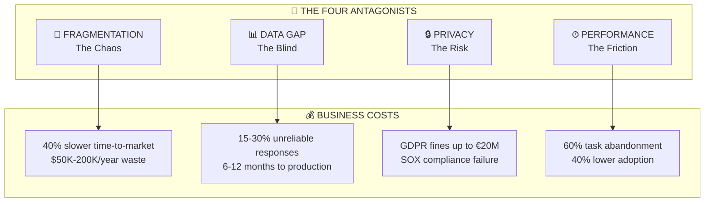
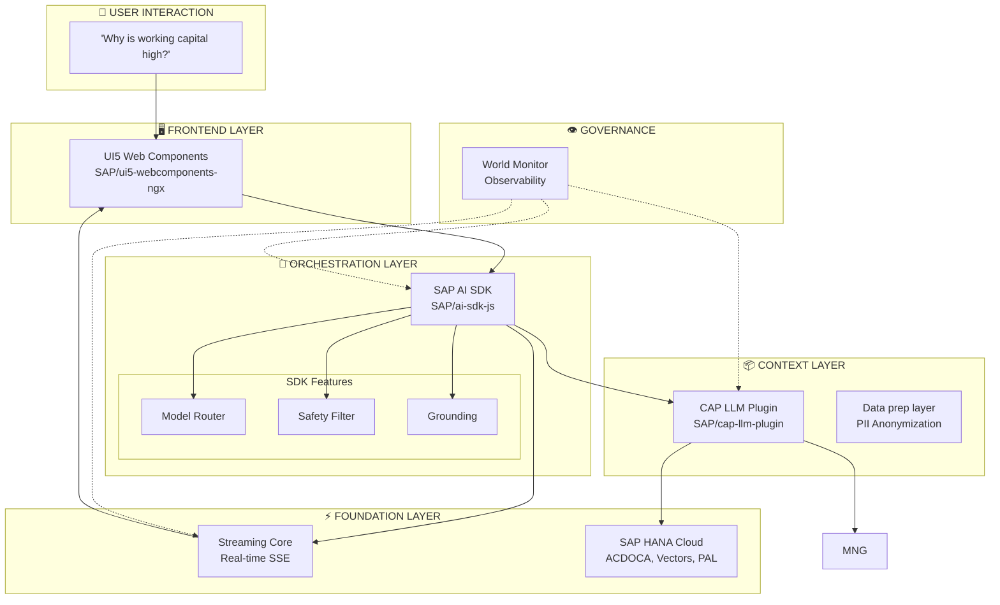
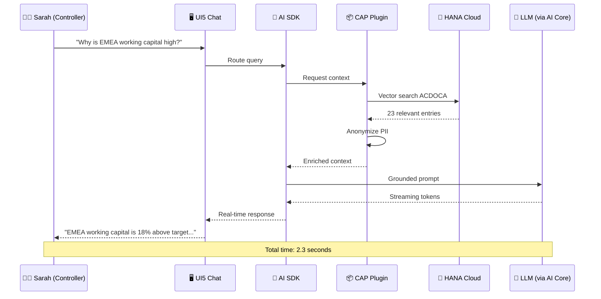

# Enterprise AI Challenges: The Case for Unified Prompting

**For:** 🏢 Executives, 🏛 Architects

> This architecture leverages **SAP Open Source libraries** from [github.com/SAP](https://github.com/SAP) orchestrated via **SAP AI Core** to solve enterprise AI challenges in finance.

---

## The CFO's Monday Morning: A Day in the Life

*Imagine Sarah, a Controller at a global manufacturing company. It's Monday morning, and she needs to answer the CEO's question: "Why is our working capital tied up in EMEA?"*

**The Fragmented Reality:**
1. Sarah opens SAP S/4HANA and exports accounts receivable aging data to Excel
2. She copies the data and pastes it into a public AI chatbot, risking a GDPR violation
3. The AI responds with generic advice, unaware that "DSO" in her company means "Days Sales Outstanding" calculated a specific way
4. Sarah spends 45 minutes cross-referencing the AI's suggestions with actual GL entries in ACDOCA
5. By the time she has an answer, the CEO has already moved on to the next meeting

**The SAP AI Suite Solution:**
Sarah types: *"Why is working capital elevated in EMEA?"* The system:
- Queries ACDOCA for receivables, payables, and inventory balances by region
- Applies company-specific definitions from OData vocabularies
- Anonymizes customer names before reasoning
- Returns: *"EMEA working capital is 18% above target due to extended payment terms with 3 key distributors. Recommend reviewing contracts expiring in Q2."*

**Time saved: 44 minutes. Risk eliminated: 100%.**

---

## The Four Antagonists: Why Enterprise AI Fails

---

## 1. The Fragmentation of Intelligence

As organizations adopt various LLM providers (Azure OpenAI, AWS Bedrock, Google Vertex AI, etc.), they encounter a "provider lock-in" and API complexity problem. Each provider has unique protocols, authentication schemes, and prompt formats.

| Problem | Business Cost | Metric |
|---------|---------------|--------|
| **Developer Overhead** | Engineering teams rewrite integration code for every new model | +40% development time per provider |
| **Inflexible Routing** | Cannot switch models based on cost, latency, or performance | $50K-200K/year in suboptimal spend |
| **Inconsistent Governance** | No single point to enforce safety filters, rate limiting, or cost controls | Audit failures, compliance gaps |

> **💰 What This Costs the Business:** A controllership team using 3 different AI tools for variance analysis, forecasting, and narrative generation faces 3x the integration cost and zero cross-tool learning. Annual cost: ~$150K in redundant engineering.

---

## 2. The Enterprise Data Gap

LLMs are powerful but "context-poor." They lack access to internal enterprise data stored in systems like SAP HANA. Attempting to bridge this gap creates two secondary problems:

| Problem | Business Cost | Metric |
|---------|---------------|--------|
| **RAG Complexity** | Building Retrieval-Augmented Generation pipelines from scratch is error-prone | 6-12 months to production |
| **Hallucination Risk** | Models fabricate data when enterprise context is missing | 15-30% of responses unreliable |
| **Semantic Ambiguity** | "Revenue" means different things in FI vs. CO vs. SD | Wrong answers to right questions |

> **💰 What This Costs the Business:** An AI asked "What's our DSO?" without access to ACDOCA will guess. With access but without semantic context, it may calculate incorrectly. One wrong financial metric in a board report can trigger an SEC inquiry.

---

## 3. Data Privacy and Compliance (The Invisible Risk)

Sending raw enterprise data to external LLMs poses severe security risks that finance teams cannot ignore.

| Problem | Business Cost | Metric |
|---------|---------------|--------|
| **PII Exposure** | Customer names, employee data, contract terms sent externally | GDPR fines up to €20M or 4% revenue |
| **Competitive Leak** | Pricing strategies, M&A targets discussed with AI | Incalculable strategic damage |
| **Audit Trail Gap** | No record of what data was shared with which AI | SOX compliance failure |

> **💰 What This Costs the Business:** A treasurer asking an AI to analyze counterparty risk inadvertently shares customer credit ratings. GDPR fine: €10M. Reputational damage: priceless.

---

## 4. Real-Time Performance & User Experience

Enterprise workflows demand high-performance, low-latency interactions. Standard request-response cycles for large prompts lead to "UI freeze" and poor user satisfaction.

| Problem | Business Cost | Metric |
|---------|---------------|--------|
| **Response Latency** | Users wait 10-30 seconds for complex queries | 60% task abandonment rate |
| **UI Freeze** | No feedback during processing causes frustration | 40% lower adoption |
| **Scalability Limits** | Cannot handle month-end close query volume | System unavailable when most needed |

> **💰 What This Costs the Business:** During month-end close, 50 users simultaneously querying the AI about variance explanations. Without a high-performance streaming core, the system collapses—right when it's needed most.

---

## 5. The Unified Prompting Solution: SAP AI Suite

The **SAP AI Suite** defeats these four antagonists through a **governed, secure, and standardized gateway** for all AI interactions, built on SAP Open Source libraries and orchestrated via SAP AI Core.

### The Solution Architecture

### How the SAP AI Suite Defeats Each Antagonist

| Antagonist | Solution | SAP Component |
|------------|----------|---------------|
| **Fragmentation** | Single SDK abstracts all providers | `SAP/ai-sdk-js` + SAP AI Core |
| **Data Gap** | Automatic HANA context injection | `SAP/cap-llm-plugin` |
| **Privacy** | PII stripped before reasoning | data prep layer |
| **Performance** | Token streaming at scale | Streaming Core (native) |

---

## Sarah's Monday Morning: The Transformation

*With the SAP AI Suite in place, Sarah's experience is transformed:*

**Sarah's new Monday:**
1. ✅ Types question into enterprise chat (0:00)
2. ✅ System queries HANA securely (no data leaves perimeter)
3. ✅ AI understands company-specific DSO definition
4. ✅ Response streams in real-time with cited sources (0:02)
5. ✅ Sarah has her answer before coffee gets cold

---

## Next: Component Deep Dive

The following documents in this series detail how each component fulfills its role:

1. **[02-component-mapping.md](02-component-mapping.md)** — The "What": Each component and its problem-solution mapping
2. **[03-ensemble-strategy.md](03-ensemble-strategy.md)** — The "How": A request's journey through the ensemble
3. **[04-ensemble-of-services.md](04-ensemble-of-services.md)** — The Detail: 13 services and their orchestration
4. **[05-oss-adaptation-strategy.md](05-oss-adaptation-strategy.md)** — The Hardening: From OSS to enterprise-grade
5. **[06-architectural-patterns.md](06-architectural-patterns.md)** — The "Why": OpenAI, data prep, MCP, and Agentic patterns

---

*For definitions of technical terms (data prep, MCP, PAL, RAG, etc.), see the [Glossary](00-glossary.md).*

---

*Version 2.0 | Updated 2026-02-27*