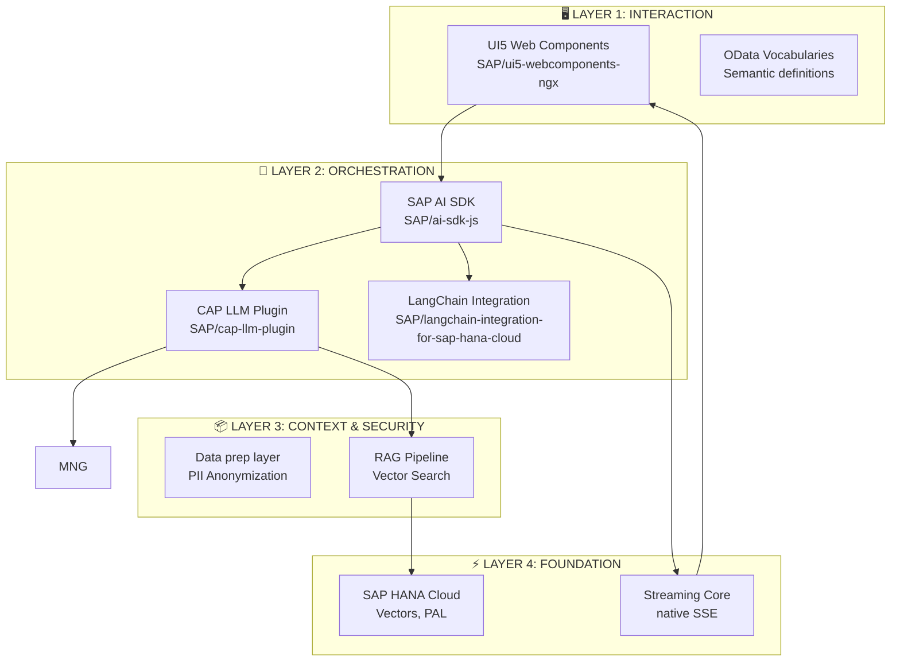
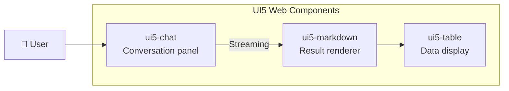
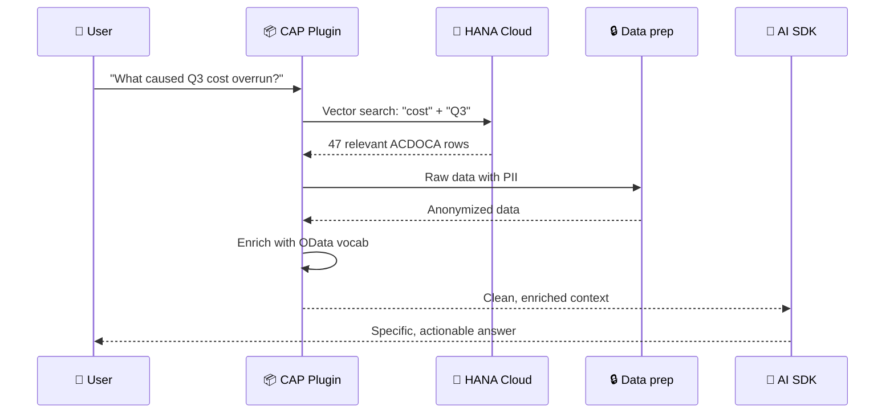
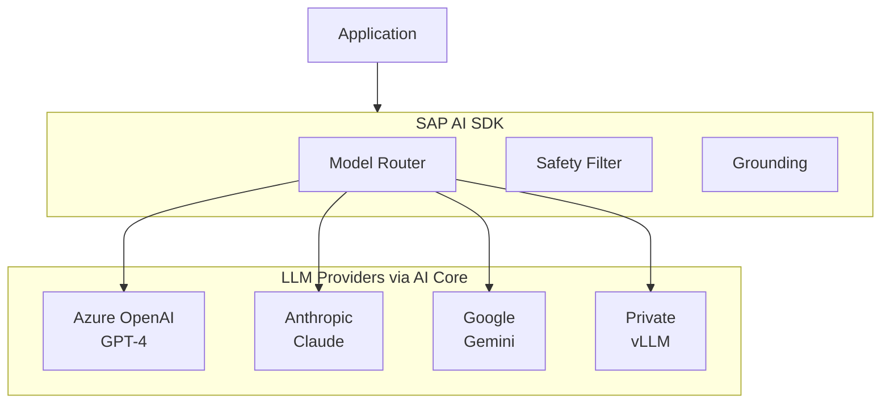
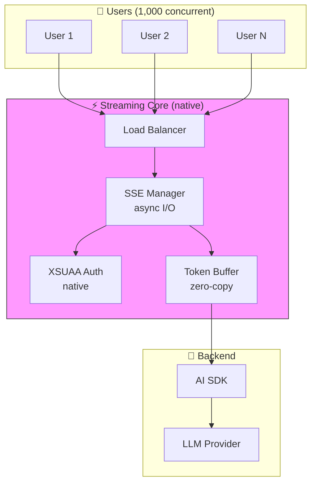
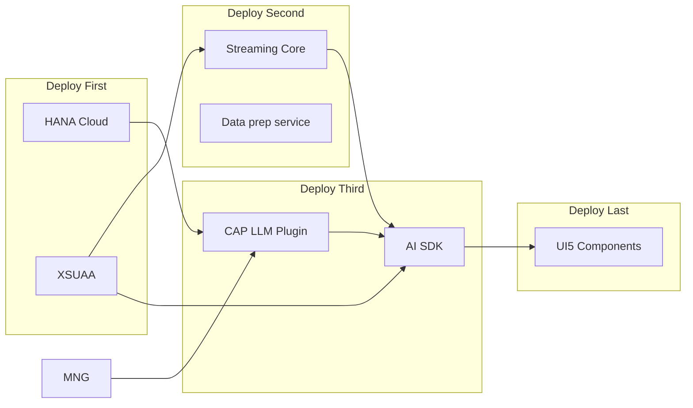
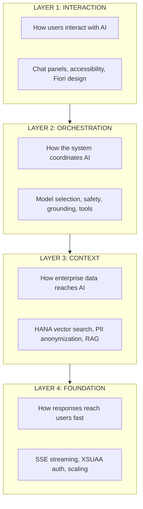

# Component Mapping: Building a Multi-Layered Enterprise AI Stack

**For:** 🏛 Architects, 👩‍💻 Developers

> This architecture leverages **SAP Open Source libraries** from [github.com/SAP](https://github.com/SAP) orchestrated via **SAP AI Core**.

---

## Quick Reference: Component-to-Problem Mapping

| Component | SAP OSS Repository | Problem Solved | Finance Use Case |
|-----------|-------------------|----------------|------------------|
| **UI5 Web Components** | `SAP/ui5-webcomponents-ngx` | Inconsistent UI/UX | Standard chat interface |
| **CAP LLM Plugin** | `SAP/cap-llm-plugin` | Data Gap & PII Risk | Auto-retrieve ACDOCA, mask names |
| **AI SDK JS** | `SAP/ai-sdk-js` | Provider Fragmentation | Switch GPT-4/Claude in config |
| **Streaming Core** | Custom (streaming) | Performance & Scale | 50 concurrent users at month-end |

---

## Component Architecture



---

## 1. Frontend Layer: UI5 Web Components for Angular

**Problem Addressed**: Inconsistent AI UI/UX and Accessibility.

The **`SAP/ui5-webcomponents-ngx`** library provides ready-to-use, enterprise-themed Angular components (chat panels, result viewers, markdown renderers) that ensure a consistent experience across AI applications.

### Capabilities
- **Chat Components**: Pre-built conversation UI with streaming support
- **Result Renderers**: Markdown, tables, charts for AI responses
- **Accessibility**: WCAG 2.1 compliant, keyboard navigation, screen reader support



| Aspect | Value |
|--------|-------|
| **Development Time** | 60% faster than custom UI |
| **Consistency** | SAP Fiori design language |
| **Repository** | [SAP/ui5-webcomponents-ngx](https://github.com/SAP/ui5-webcomponents-ngx) |

---

## 2. Middleware Layer: CAP LLM Plugin

**Problem Addressed**: The Enterprise Data Gap & Data Privacy (PII).

The **`SAP/cap-llm-plugin`** acts as the intelligent bridge between enterprise data and the LLM. It automates the Retrieval-Augmented Generation (RAG) process.

### Capabilities

| Capability | Function | Finance Relevance |
|------------|----------|-------------------|
| **HANA Vector Search** | Retrieves relevant enterprise context from SAP HANA Cloud | Find similar past variance explanations |
| **Anonymization Engine** | Automatically detects and masks sensitive data (PII) | Remove customer names, employee IDs |
| **Semantic Enrichment** | Adds metadata from OData vocabularies | AI understands "BUKRS" means Company Code |

### How It Solves the Data Gap



| Aspect | Value |
|--------|-------|
| **Security** | Zero PII sent to external LLMs |
| **Accuracy** | Responses grounded in actual HANA data |
| **Repository** | [SAP/cap-llm-plugin](https://github.com/SAP/cap-llm-plugin) |

---

## 3. SDK Layer: SAP AI SDK for JavaScript

**Problem Addressed**: Model Provider Fragmentation and Orchestration.

The **`SAP/ai-sdk-js`** standardizes access to multiple foundation models and the SAP AI Core Generative AI Hub.

### Capabilities

| Capability | Function | Finance Relevance |
|------------|----------|-------------------|
| **Model Abstraction** | Single API for OpenAI, Gemini, Claude, local vLLM | Use best model per task |
| **Safety Filtering** | Enforces content filtering to prevent harmful outputs | Block inappropriate content |
| **Grounding** | Ensures responses tied to provided context | Prevent hallucinated numbers |
| **Tool Calling** | Invoke MCP tools during reasoning | Call PAL for forecast |

### Provider Flexibility



```typescript
// Unified SDK (single interface for all providers)
import { OrchestrationClient } from '@sap-ai-sdk/orchestration';

const response = await client.chatCompletion({
  model: 'gpt-4',  // or 'claude-3' or 'gemini-pro' or 'vllm-local'
  messages: [{ role: 'user', content: message }],
  safetyFilter: 'enterprise',
  grounding: { source: 'hana-vectors' }
});
```

| Aspect | Value |
|--------|-------|
| **Lock-in Prevention** | Switch providers in config, not code |
| **Governance** | Single enforcement point for safety, cost, logging |
| **Repository** | [SAP/ai-sdk-js](https://github.com/SAP/ai-sdk-js) |

---

## 4. Streaming Core: High-Performance Gateway

**Problem Addressed**: Real-Time Performance and Scalability.

The Streaming Core is a high-performance, low-latency engine designed for massive throughput. Built for low-latency streaming, it acts as a high-performance gateway for AI responses.

### Why a dedicated streaming gateway?

| Aspect | Benefit | Alternative Comparison | When to Use |
|--------|---------|----------------------|-------------|
| **Performance** | C-level speed, no GC pauses | 10x faster than Node.js | All external-facing streaming |
| **Memory Safety** | Compile-time guarantees | Safer than C | High-concurrency endpoints |
| **Concurrency** | Native async I/O, 10,000+ connections | 5x more than Python | Month-end close scenarios |
| **Resource Efficiency** | 50MB for 1,000 streams | Node.js needs 500MB+ | Cost-sensitive deployments |

### Deployment Architecture



| Aspect | Value |
|--------|-------|
| **User Experience** | "Speed of thought" interactivity |
| **Scalability** | 50 concurrent users during month-end |
| **Metrics** | Memory: 50MB | Latency: <5ms | Throughput: 50K tokens/s |

---

## Component Interdependencies

Understanding deployment ordering and dependencies:



| Component | Depends On | Deployment Order |
|-----------|------------|------------------|
| HANA Cloud | — | 1st |
| XSUAA | — | 1st |
| Streaming Core | XSUAA | 2nd |
| Data prep service | HANA | 2nd |
| CAP LLM Plugin | HANA, data prep | 3rd |
| AI SDK | XSUAA, Streaming, CAP | 4th |
| UI5 Components | AI SDK | 5th |

---

## Summary: The Four Layers Working Together



---

## Next Steps

- **[03-ensemble-strategy.md](03-ensemble-strategy.md)** — See how these layers work together in a real request flow
- **[00-glossary.md](00-glossary.md)** — Definitions of terms used in this document

---

*Version 2.0 | Updated 2026-02-27*