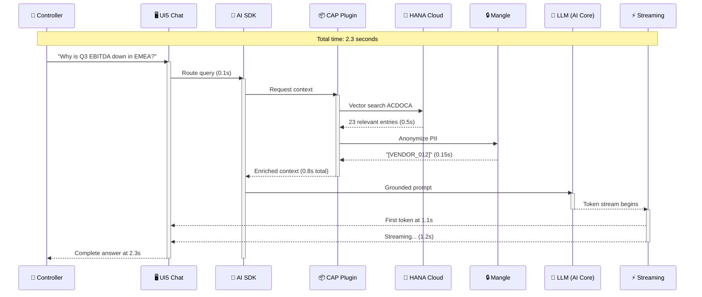
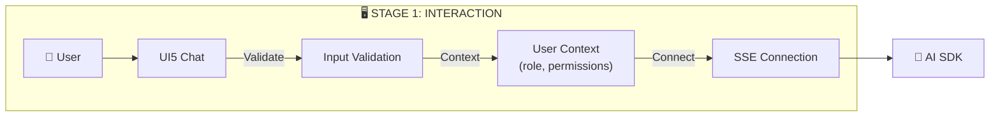
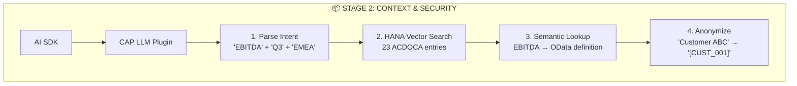
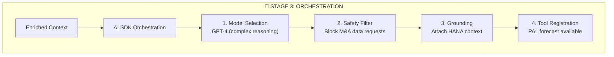
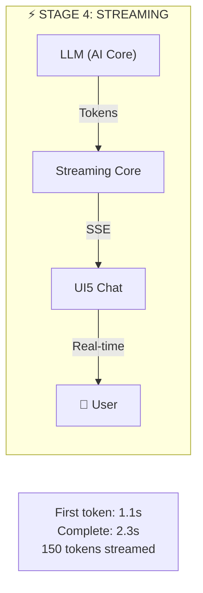
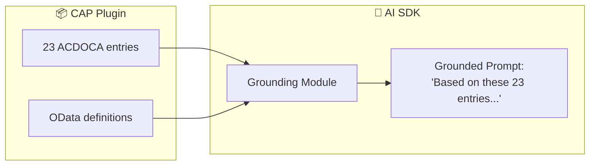
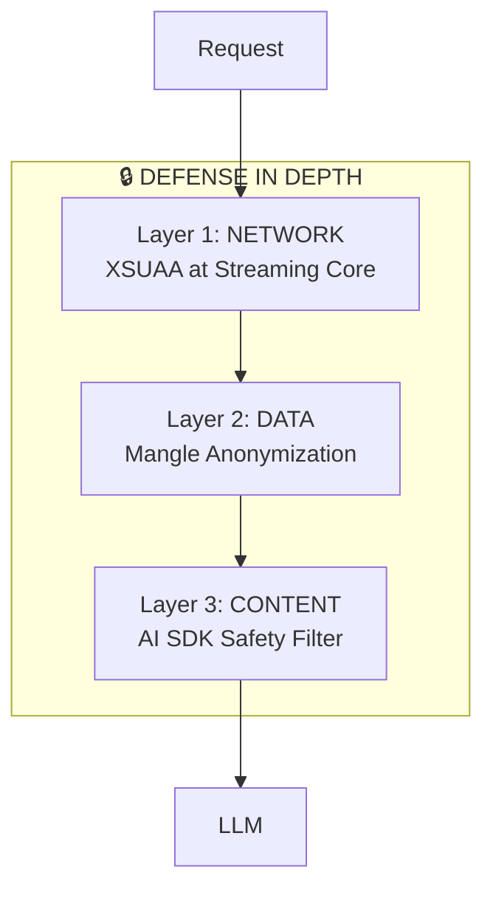
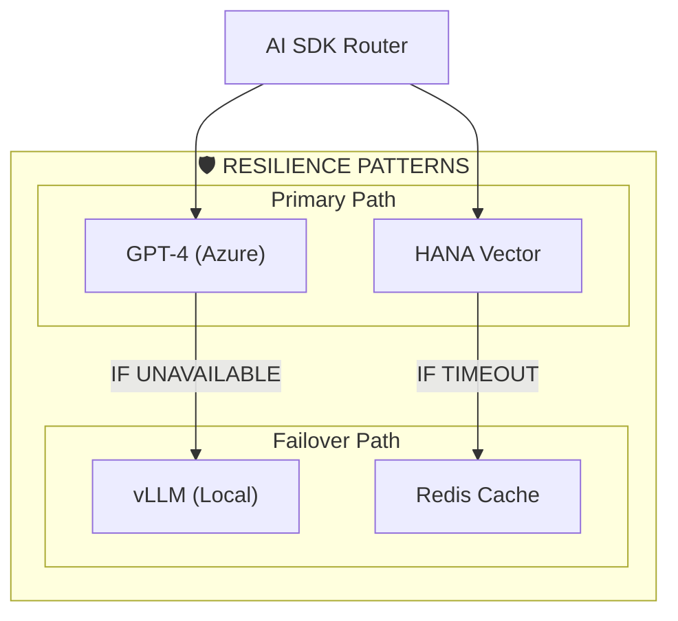
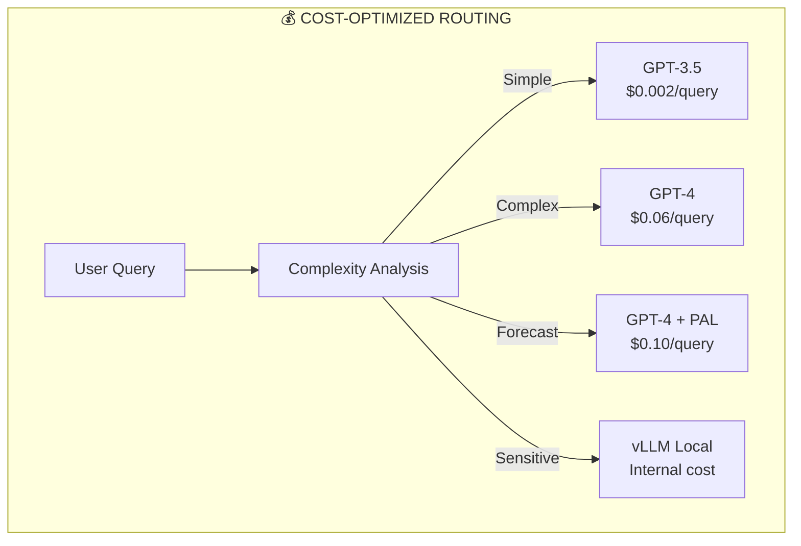
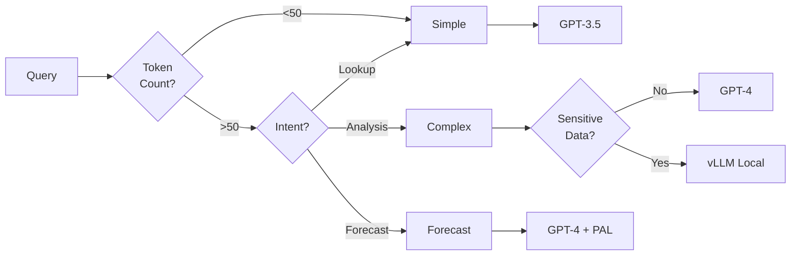

# The Ensemble in Action: A Request's Journey

**For:** 🏛 Architects, 🔐 Security Officers

> This architecture leverages **SAP Open Source libraries** from [github.com/SAP](https://github.com/SAP) orchestrated via **SAP AI Core**.

---

## The Request Journey: User to Answer in 2.3 Seconds



---

## Stage Details

### Stage 1: Interaction (0-0.1s)



| Action | Component | Time |
|--------|-----------|------|
| Input validation | UI5 Chat | 20ms |
| User context attachment | XSUAA | 50ms |
| SSE connection established | Streaming Core | 30ms |

### Stage 2: Contextualization & Security (0.1-0.9s)



| Action | Technology | Time |
|--------|------------|------|
| Intent parsing | CAP service | 50ms |
| Vector search | HANA Cloud | 500ms |
| Vocabulary lookup | OData service | 100ms |
| PII anonymization | Mangle layer | 150ms |

### Stage 3: Governance & Orchestration (0.9-1.1s)



| Action | Technology | Time |
|--------|------------|------|
| Model selection | AI SDK routing | 50ms |
| Safety filtering | Content filter | 30ms |
| Context grounding | SDK orchestrator | 80ms |
| Tool registration | MCP protocol | 40ms |

### Stage 4: High-Performance Delivery (1.1-2.3s)



| Action | Technology | Time |
|--------|------------|------|
| Token generation | LLM (GPT-4) | 1100ms |
| SSE streaming | Zig async I/O | <5ms latency |
| Total response | 150 tokens | 1200ms |

---

## Key Synergies

### RAG + Orchestration



### Defense in Depth



| Layer | Protection | Component |
|-------|------------|-----------|
| **Network** | Token validation, role-based access | XSUAA + Streaming Core |
| **Data** | PII masking, data classification | Mangle layer |
| **Content** | Harmful content blocking, compliance | AI SDK Safety Filter |

---

## Failure Handling & Resilience



### Failure Scenarios

| Failure | Detection | Recovery | User Impact |
|---------|-----------|----------|-------------|
| **LLM Provider Down** | SDK health check | Auto-failover to vLLM | <3s delay |
| **HANA Timeout** | 5s timeout | Serve cached context | Degraded + warning |
| **Streaming Overload** | Load threshold | Horizontal scale-out | Queue delay |
| **PII Leak Attempt** | Mangle detection | Block + alert | Request rejected |

### Circuit Breaker

```typescript
// AI SDK implements circuit breaker pattern
const response = await aiSdk.orchestration.complete({
  model: 'gpt-4',
  fallback: {
    provider: 'vllm-local',
    maxLatency: 5000,
    healthCheck: '/v1/health'
  },
  resilience: {
    retries: 3,
    backoff: 'exponential',
    circuitBreaker: {
      failureThreshold: 5,
      resetTimeout: 30000
    }
  }
});
```

---

## Cost-Optimized Model Routing



### Routing Decision Flow



### Cost Savings Example

| Usage Pattern | Without Routing | With Routing | Savings |
|---------------|----------------|--------------|---------|
| 10,000 simple queries | $600 | $20 | 97% |
| 5,000 complex queries | $300 | $300 | 0% |
| 1,000 sensitive queries | $60 (risk) | $0 | 100% + security |
| **Monthly Total** | **$960** | **$320** | **67%** |

---

## Summary: The Ensemble Advantage

| Capability | How It's Achieved | Business Value |
|------------|-------------------|----------------|
| **Speed** | Zig streaming + SSE | 2.3s response |
| **Accuracy** | HANA RAG + OData | No hallucinations |
| **Security** | Defense-in-depth | Zero PII exposure |
| **Resilience** | Circuit breaker | 99.9% availability |
| **Cost** | Intelligent routing | 67% reduction |

---

## Next Steps

- **[04-ensemble-of-services.md](04-ensemble-of-services.md)** — Deep dive into all 13 services
- **[00-glossary.md](00-glossary.md)** — Definitions of terms used in this document

---

*Version 2.0 | Updated 2026-02-27*