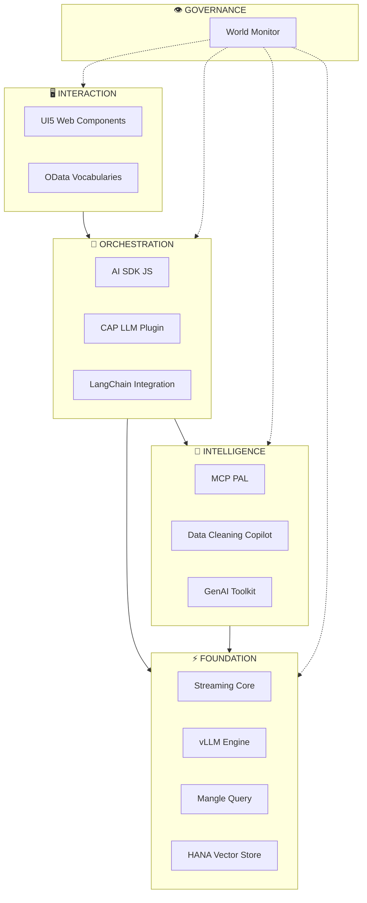
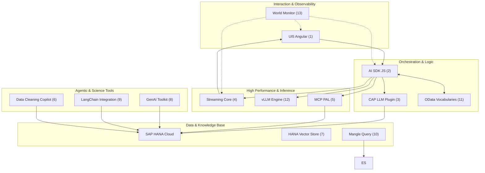
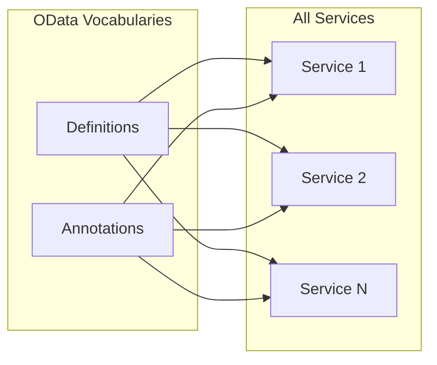
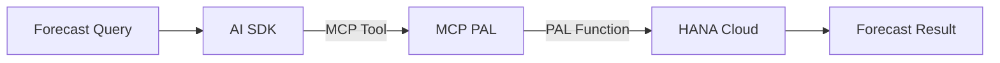
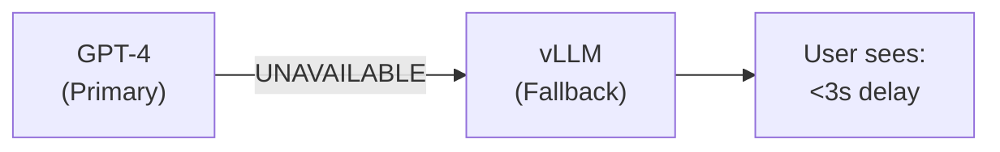
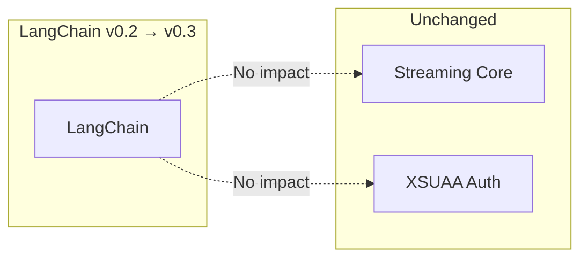
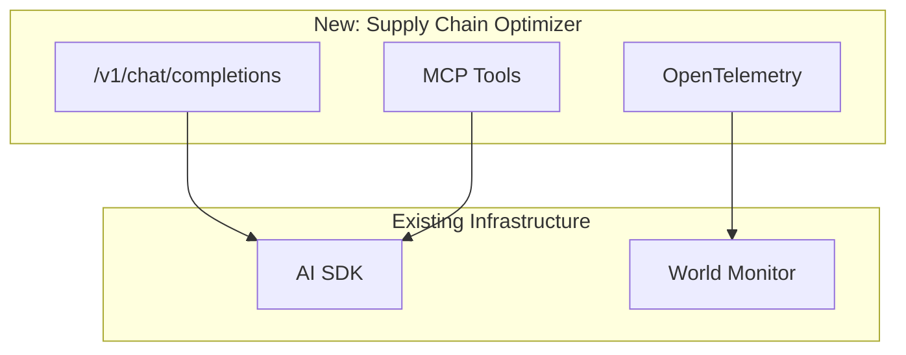

# The Collective Intelligence Framework: 13 Services

**For:** 👩‍💻 Developers, 🏛 Architects

> This architecture leverages **SAP Open Source libraries** from [github.com/SAP](https://github.com/SAP) orchestrated via **SAP AI Core**.

---

## The Five Pillars of Enterprise AI

| Pillar | Services | Purpose |
|--------|----------|---------|
| **Interaction** | UI5 Web Components, OData Vocabularies | User interface, semantic standards |
| **Orchestration** | AI SDK, CAP LLM Plugin, LangChain | Model routing, RAG, privacy |
| **Intelligence** | MCP PAL, Data Copilot, GenAI Toolkit | Forecasting, data quality, ML |
| **Foundation** | Streaming Core, vLLM, Mangle, HANA Vector Store | Performance, search, transformation |
| **Governance** | World Monitor | Observability, tracing, audit |

---

## Service Flow Architecture

---

## Reasoning Chain Deep Dive

### Semantic Standard (OData Vocabularies)

| Aspect | Reasoning | Technology |
|--------|-----------|------------|
| **Purpose** | "All services use same definition for 'EBITDA'" | OData `sap.ai.prompt.Prompt` type |
| **Finance Example** | Same calculation across chat, PAL, dashboard | `@Analytics.Measure` on ACDOCA |

### Predictive Bridge (MCP PAL)

| Aspect | Reasoning | Technology |
|--------|-----------|------------|
| **Purpose** | "This needs math, not just text" | HANA PAL `ARIMA_FORECAST` |
| **Finance Example** | "Project next quarter revenue" | MCP `pal_forecast` tool |

---

## Business Value

### Value 1: Resilience

### Value 2: Modularity

### Value 3: Extensibility

**Integration time: ~2 hours (no SDK changes)**

---

## The 13 Services Quick Reference

| # | Service | Pillar | SAP Repository | Finance Use Case |
|---|---------|--------|----------------|------------------|
| 1 | UI5 Web Components | Interaction | `SAP/ui5-webcomponents-ngx` | Chat dashboard |
| 2 | AI SDK JS | Orchestration | `SAP/ai-sdk-js` | Model routing |
| 3 | CAP LLM Plugin | Orchestration | `SAP/cap-llm-plugin` | ACDOCA RAG |
| 4 | Streaming Core | Foundation | Custom (Zig) | Real-time delivery |
| 5 | MCP PAL | Intelligence | Custom | Sales forecast |
| 6 | Data Cleaning Copilot | Intelligence | Custom | Data quality audit |
| 7 | HANA Vector Store | Foundation | SAP HANA Cloud | Knowledge search |
| 8 | GenAI Toolkit | Intelligence | `SAP/generative-ai-toolkit-for-sap-hana-cloud` | Custom ML |
| 9 | LangChain Integration | Orchestration | `SAP/langchain-integration-for-sap-hana-cloud` | Vector store |
| 10 | Mangle Query | Foundation | Custom | Log transformation |
| 11 | OData Vocabularies | Interaction | Custom | Semantic definitions |
| 12 | vLLM | Foundation | vLLM | Private LLM |
| 13 | World Monitor | Governance | Custom | Observability |

---

## Next Steps

- **[05-oss-adaptation-strategy.md](05-oss-adaptation-strategy.md)** — How SAP OSS was hardened
- **[06-architectural-patterns.md](06-architectural-patterns.md)** — The four design patterns

---

*Version 2.0 | Updated 2026-02-27*