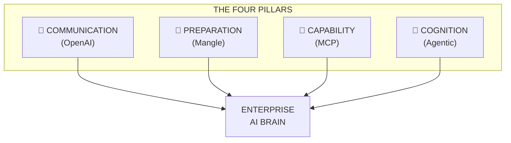
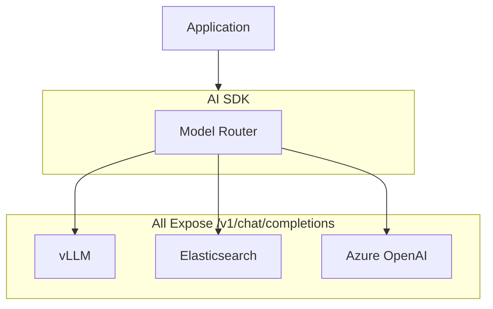
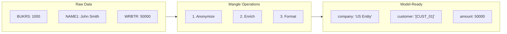
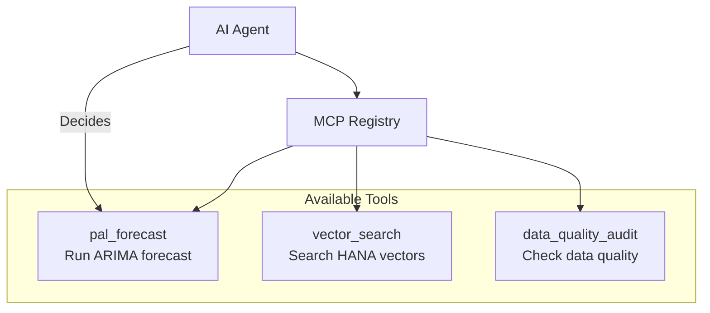
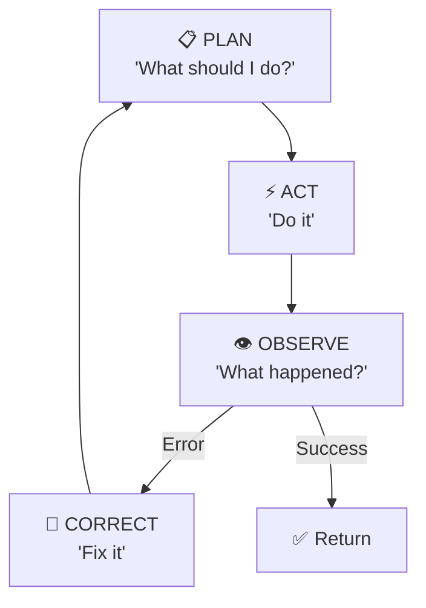
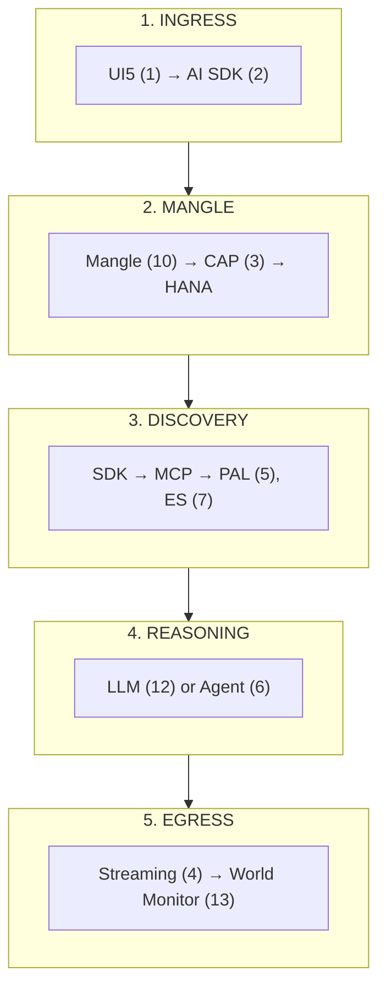
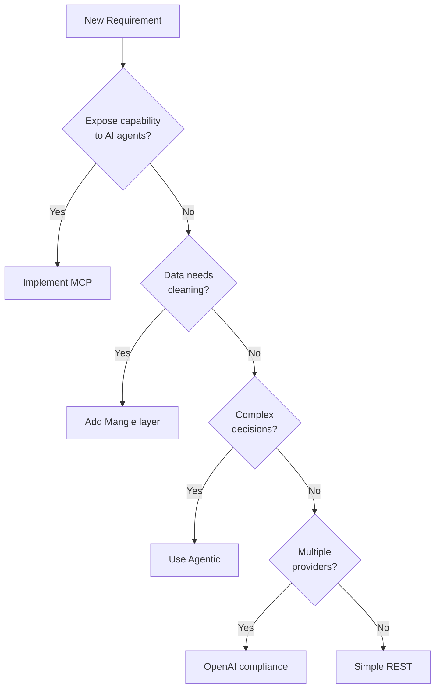

# Architectural Patterns: OpenAI, Mangle, MCP, Agentic

**For:** 🏛 Architects, 👩‍💻 Developers

> This architecture leverages **SAP Open Source libraries** from [github.com/SAP](https://github.com/SAP) orchestrated via **SAP AI Core**.

---

## Why These Four Patterns?



| Pattern | Phase | Question | Without It |
|---------|-------|----------|------------|
| **OpenAI Compliance** | Communication | "How do services talk?" | Custom code per integration |
| **Mangle** | Preparation | "Is data safe?" | PII leaks, noisy context |
| **MCP** | Capability | "What can AI do?" | Hard-coded functions |
| **Agentic** | Cognition | "How does AI decide?" | Brittle if-else trees |

---

## Pattern Summary: The Way vs. Anti-Pattern

| Pattern | ✅ The Pattern | ❌ Anti-Pattern | Value |
|---------|---------------|----------------|-------|
| **OpenAI** | `/v1/chat/completions` everywhere | Custom code per provider | Swappable services |
| **Mangle** | Clean data *before* reasoning | Hope model ignores PII | Security + quality |
| **MCP** | Discoverable "Tools" | Hard-coded function calls | Extensible agents |
| **Agentic** | Plan → Act → Observe → Correct | Linear if-else trees | Self-healing |

---

## 1. OpenAI Compliance: Universal Interface



#### Anti-Pattern
```javascript
// ❌ Provider-specific code
if (provider === 'vllm') {
  response = await axios.post(`${vllmUrl}/generate`);
} else if (provider === 'elasticsearch') {
  response = await esClient.search({ ... });
} else if (provider === 'openai') {
  response = await openai.chat.completions.create({ ... });
}
```

#### The Pattern
```typescript
// ✅ Single interface for all
const response = await sdk.chatCompletion({
  model: config.model,  // vllm, elasticsearch, gpt-4
  messages: [{ role: 'user', content: message }]
});
```

---

## 2. Mangle: Data Sanitization



#### Anti-Pattern
```javascript
// ❌ Send raw data, hope for the best
const response = await llm.complete({
  prompt: `Analyze: ${JSON.stringify(rawAcdocaRows)}`
  // Includes: customer names, SSNs, bank accounts...
});
```

---

## 3. MCP: Services as Tools



#### Anti-Pattern
```javascript
// ❌ Hard-coded function calls
if (query.includes('forecast')) {
  return await palForecast(query);  // Can't add new tools
} else if (query.includes('search')) {
  return await vectorSearch(query);
}
```

#### The Pattern
```typescript
// ✅ Agent discovers and invokes tools
const tools = await mcp.listTools();
const result = await agent.invoke({
  query: userQuery,
  availableTools: tools  // Agent decides which to use
});
```

---

## 4. Agentic Reasoning: Autonomous Loop



#### Anti-Pattern
```javascript
// ❌ Linear, no self-correction
const data = await fetchData();
if (!data) return "No data";  // Stop
const forecast = await runForecast(data);
if (!forecast) return "Failed";  // Stop - no retry
return formatResult(forecast);
```

---

## Request-to-Reasoning Pipeline



---

## Pattern Decision Tree



---

## Summary

| Benefit | Pattern | Impact |
|---------|---------|--------|
| **Interoperability** | OpenAI | Add models in hours |
| **Security** | Mangle | Zero PII exposure |
| **Autonomy** | MCP | Any registered tool |
| **Resilience** | Agentic | Self-correcting |

---

## Next Steps

- **[00-glossary.md](00-glossary.md)** — Terms reference
- **[01-enterprise-ai-problem.md](01-enterprise-ai-problem.md)** — Problems these patterns solve

---

*Version 2.0 | Updated 2026-02-27*