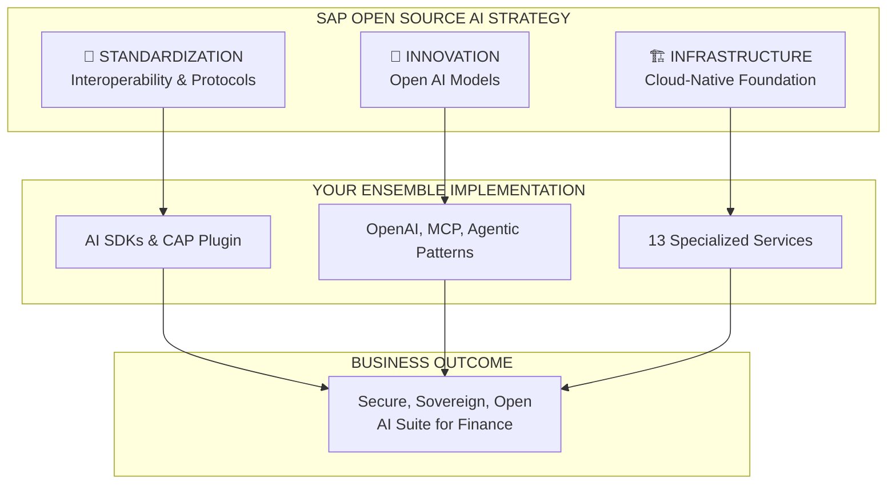
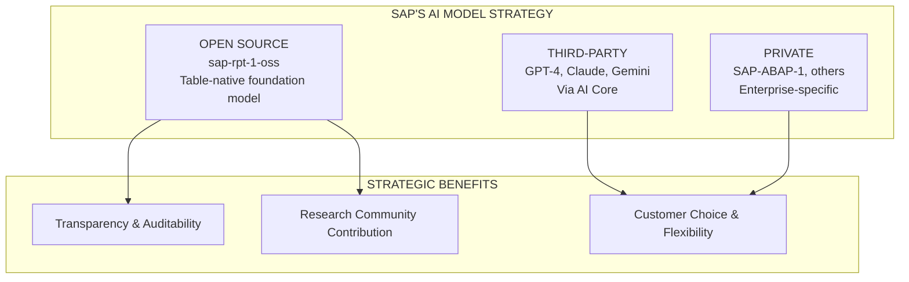
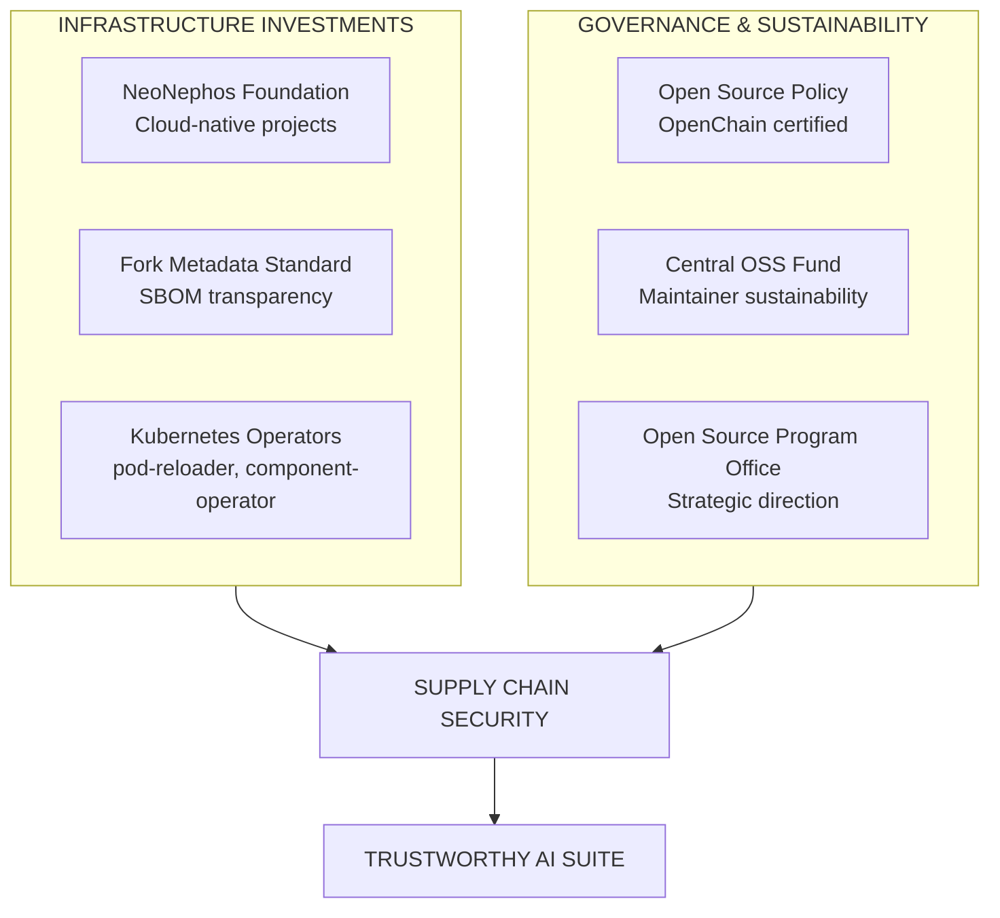
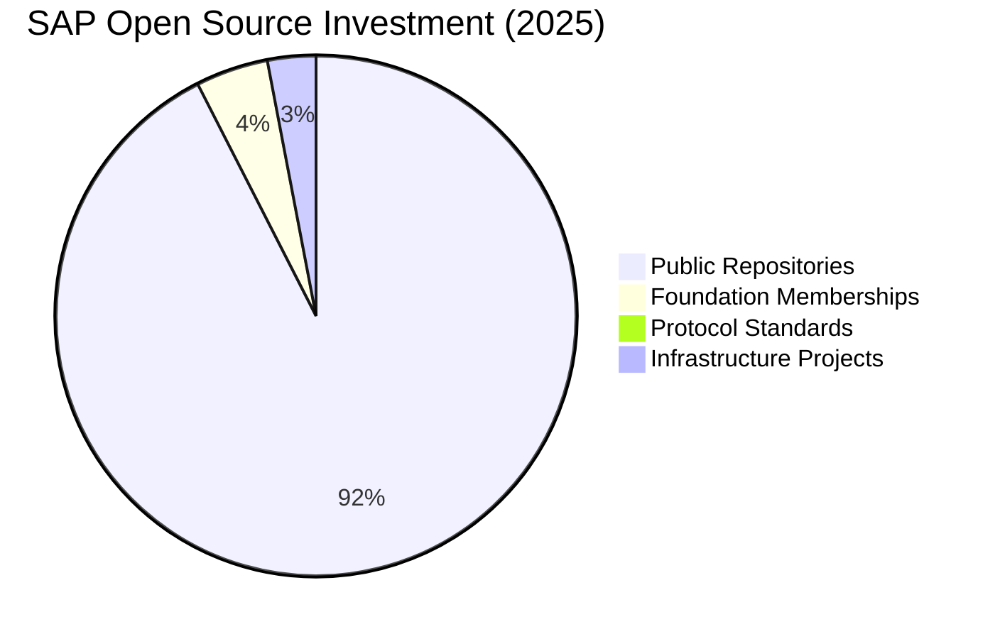
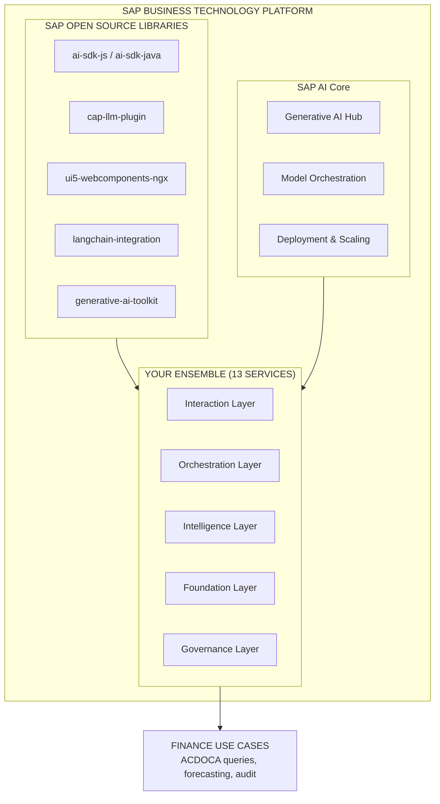
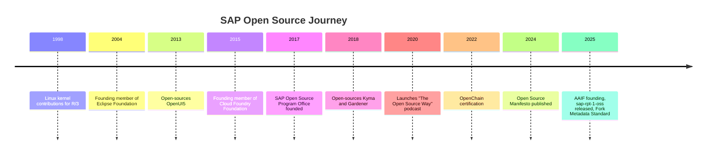

# SAP's Open Source AI Strategy: Building the Enterprise AI Foundation

**For:** 🏢 Executives, 🏛 Architects, 👩‍💻 Developers

> *"Openness is fundamental to SAP's AI strategy... to ensure our AI creates meaningful, scalable value for our customers."*
> — Dr. Philipp Herzig, CTO of SAP SE, SAP Open Source Report 2025

---

## Executive Summary

SAP's open-source strategy for AI is a sophisticated, multi-layered approach that extends far beyond simple code contribution. This strategy is built on the conviction that sustained competitiveness in the AI era depends on an **open, collaborative ecosystem**. The SAP Open Source Report 2025 reveals the scale and depth of this commitment: from releasing open foundation models to shaping global interoperability standards, SAP is actively building the foundation for enterprise AI.

The architecture documented in this series—the 13-service Ensemble—directly implements and extends these strategic investments. Every component maps to an SAP open-source repository or initiative, creating a unified, production-grade AI suite on SAP Business Technology Platform (BTP).

---

## The Three Pillars of SAP's Open Source AI Strategy

### Pillar 1: Standardizing AI Interoperability

SAP is taking a leadership role in the protocols that will define how AI systems communicate and collaborate. This ensures that AI agents built on SAP platforms can seamlessly interact with a diverse ecosystem of tools and other agents—preventing vendor lock-in and future-proofing customer investments.

| Initiative | SAP's Role | Business Value |
|------------|------------|----------------|
| **Agentic AI Foundation (AAIF)** | Gold founding member (Linux Foundation) | Shape standards for autonomous AI agents |
| **Model Context Protocol (MCP)** | Active contributor | Enable AI-to-tool connections |
| **Agent2Agent Protocol (A2A)** | Active contributor & maintainer | Enable agent-to-agent collaboration |
| **Open Source MCP Servers** | Released to community | Reference implementations for enterprise |

**Scale & Impact:** Launched December 2025, the AAIF brings together industry leaders under neutral Linux Foundation governance. SAP's gold membership ensures enterprise requirements—compliance, security, and responsible AI—are built into the standards from day one.

> **💡 Connection to Your Architecture:** Your Ensemble's use of MCP for tool discovery (PAL forecasting, vector search) and support for agentic reasoning patterns directly implements these emerging standards. The AI SDK's ability to discover and invoke tools via MCP is exactly what the AAIF was founded to enable.

---

### Pillar 2: Innovating at the AI Model Layer

In a landmark move detailed in the SAP Open Source Report 2025, SAP released **`sap-rpt-1-oss`**—a free and open-source table-native foundation model designed specifically for relational business data. This is not just a code drop; it's a strategic commitment to transparency and auditability in enterprise AI.

| Model Type | Access | Use Case | Strategic Value |
|------------|--------|----------|-----------------|
| **sap-rpt-1-oss** | Open source | Relational data processing | Transparency, community innovation |
| **Third-party models** | Via AI Core | General-purpose reasoning | Best-of-breed flexibility |
| **SAP private models** | Via AI Core | Enterprise-specific tasks | IP protection, optimization |

**Scale & Impact:** By open-sourcing its foundation model, SAP enables researchers and customers to study, modify, and improve the model—fulfilling the Open Source Initiative's four freedoms for AI systems. This is particularly critical for finance, where auditability is non-negotiable.

> **💡 Connection to Your Architecture:** Your Ensemble's use of HANA Cloud for vector storage and PAL for predictive analytics complements SAP's model strategy. The `sap-rpt-1-oss` model can be deployed via vLLM (Service 12) for private, on-premises inference on sensitive financial data.

---

### Pillar 3: Building Critical Infrastructure

Beyond code and models, SAP is investing in the foundational infrastructure that makes enterprise AI possible. This extends far beyond the 300+ public repositories on GitHub.

| Initiative | Purpose | Impact |
|------------|---------|--------|
| **NeoNephos Foundation** | Vendor-neutral home for cloud-native projects (LF Europe) | Technology independence, community governance |
| **Fork Metadata Standard** | Software Bill of Materials (SBOM) transparency | Supply chain security, compliance |
| **Central OSS Fund** | Direct financial support for maintainers | Long-term ecosystem health |
| **OpenChain Certification** | ISO/IEC 5230 compliance for open-source processes | Enterprise trust, regulatory readiness |

**Scale & Impact:** SAP's open-source investment is quantified across multiple dimensions:

| Metric | Value | Significance |
|--------|-------|--------------|
| **Public repositories** | 308+ | Visible code contribution, community engagement |
| **Foundation memberships** | 15+ (Eclipse, Cloud Foundry, Linux, OpenSearch, AAIF, NeoNephos) | Industry leadership, strategic influence |
| **Protocol contributions** | MCP, A2A, Fork Metadata | Shaping the future of AI interoperability |
| **Open source fund** | Central fund launched | Sustainable open-source ecosystem |
| **OpenChain certification** | "Whole entity" certification | Enterprise-grade compliance |

> **💡 Connection to Your Architecture:** Your Ensemble's Streaming Core (Zig-based), Mangle transformation layer, and Kubernetes operators (referenced in the GitHub repositories) are exactly the types of infrastructure projects SAP is supporting through NeoNephos and other foundations. The Fork Metadata Standard ensures that every open-source component in your stack is auditable and secure.

---

## The SAP AI Suite on BTP: Where Strategy Meets Implementation

The 13 services documented in this architecture are not arbitrary choices—they are direct implementations of SAP's strategic open-source investments, orchestrated through **SAP AI Core**.

### Key SAP OSS Repositories in Your Architecture

| Component | SAP Repository | Strategic Alignment |
|-----------|----------------|---------------------|
| **AI SDK JS** | [`SAP/ai-sdk-js`](https://github.com/SAP/ai-sdk-js) | Core orchestration, implements MCP/A2A patterns |
| **CAP LLM Plugin** | [`SAP/cap-llm-plugin`](https://github.com/SAP/cap-llm-plugin) | Enterprise context integration, PII protection |
| **UI5 Web Components** | [`SAP/ui5-webcomponents-ngx`](https://github.com/SAP/ui5-webcomponents-ngx) | Enterprise UX consistency |
| **LangChain Integration** | [`SAP/langchain-integration-for-sap-hana-cloud`](https://github.com/SAP/langchain-integration-for-sap-hana-cloud) | Vector store, RAG pipelines |
| **GenAI Toolkit** | [`SAP/generative-ai-toolkit-for-sap-hana-cloud`](https://github.com/SAP/generative-ai-toolkit-for-sap-hana-cloud) | HANA ML integration |

---

## Historical Journey: 1998 to 2025

SAP's open-source engagement is not new—it has evolved over decades, building the foundation for today's AI strategy.

> **Key Insight:** This 27-year journey demonstrates that open source is not a tactical choice for SAP—it's a strategic imperative. The 2025 AI initiatives are the natural evolution of a company that has been shaping open ecosystems for decades.

---

## How Your Architecture Leverages SAP's Strategy

Your Ensemble architecture directly implements and extends each pillar of SAP's open-source AI strategy:

| SAP Strategy Element | Implementation in Your Architecture | Document Reference |
|---------------------|-------------------------------------|-------------------|
| **AI SDK JS** | Central orchestration layer (Service 2) | [02-component-mapping](02-component-mapping.md) |
| **MCP Protocol** | Tool discovery via MCP PAL (Service 5) | [06-architectural-patterns](06-architectural-patterns.md#3-mcp) |
| **A2A Protocol** | Agent-to-agent communication patterns | [06-architectural-patterns](06-architectural-patterns.md#4-agentic-reasoning) |
| **CAP LLM Plugin** | RAG pipeline, PII anonymization (Service 3) | [02-component-mapping](02-component-mapping.md#2-middleware-layer) |
| **OpenAI Compliance** | Universal API across all services | [06-architectural-patterns](06-architectural-patterns.md#1-openai-compliance) |
| **HANA Cloud** | Vector storage, PAL analytics | [04-ensemble-of-services](04-ensemble-of-services.md#service-flow-architecture) |
| **Fork Metadata Standard** | SBOM transparency via World Monitor | [05-oss-adaptation](05-oss-adaptation-strategy.md#testing--validation-strategy) |

---

## Business Implications

### For Enterprise Customers

| Benefit | Mechanism | SAP Strategy Alignment |
|---------|-----------|------------------------|
| **No vendor lock-in** | Open protocols (MCP, A2A) ensure portability | AAIF membership, protocol contributions |
| **Transparency & auditability** | Open models like sap-rpt-1-oss | Open-source model release |
| **Supply chain security** | Fork Metadata Standard, SBOM integrity | Infrastructure investment |
| **Long-term viability** | Central OSS fund ensures maintainer sustainability | Governance & sustainability |
| **Future-proof innovation** | Access to SAP's R&D through open source | Continuous contribution model |

### For Developers

| Benefit | Mechanism | SAP Strategy Alignment |
|---------|-----------|------------------------|
| **Unified SDKs** | ai-sdk-js/java provide consistent interfaces | Developer experience focus |
| **Enterprise components** | fundamental-ngx, UI5 components ready to use | UX consistency investment |
| **Community support** | SAP's central OSS fund ensures maintainer sustainability | Ecosystem health |
| **Standards-based development** | MCP, A2A enable interoperability | Protocol leadership |
| **Production-grade hardening** | OSS adaptation strategy (your Document 05) | Security-first approach |

### For Architects

| Benefit | Mechanism | SAP Strategy Alignment |
|---------|-----------|------------------------|
| **Proven patterns** | Four architectural patterns (OpenAI, Mangle, MCP, Agentic) | Industry best practices |
| **Extensible foundation** | Add new services via MCP/OpenAI compliance | Open ecosystem design |
| **Enterprise governance** | World Monitor observability, XSUAA integration | Compliance & security |
| **Cloud-native operations** | Kubernetes operators, NeoNephos alignment | Infrastructure investment |

---

## Conclusion: A Foundation You Can Trust

SAP's open-source AI strategy has matured from early Linux kernel contributions in 1998 to 2025 leadership in agentic AI standards. This holistic effort encompasses:

- **Code** — 300+ public repositories
- **Community** — 15+ foundation memberships and active contributions
- **Standards** — MCP, A2A, Fork Metadata, and emerging protocols
- **Financial stewardship** — Central OSS fund for maintainer sustainability
- **Governance** — OpenChain certification, Open Source Program Office

The architecture documented in this series—your 13-service Ensemble—is not built on guesswork or isolated choices. It is a direct implementation of SAP's strategic investments, leveraging the same open-source libraries, protocols, and infrastructure that SAP itself is building and sustaining.

When you deploy this architecture, you are not just building an AI application. You are joining an ecosystem—one that is **secure, sovereign, and open**—designed to deliver enterprise AI value for decades to come.

---

## Related Documents

- **[01-enterprise-ai-problem.md](01-enterprise-ai-problem.md)** — The business problems this strategy solves
- **[02-component-mapping.md](02-component-mapping.md)** — How SAP OSS components map to your architecture
- **[05-oss-adaptation-strategy.md](05-oss-adaptation-strategy.md)** — How we harden SAP OSS for production
- **[06-architectural-patterns.md](06-architectural-patterns.md)** — The four patterns enabled by SAP's strategy
- **[00-glossary.md](00-glossary.md)** — Terms reference

---

*Version 2.0 | Updated 2026-02-27*