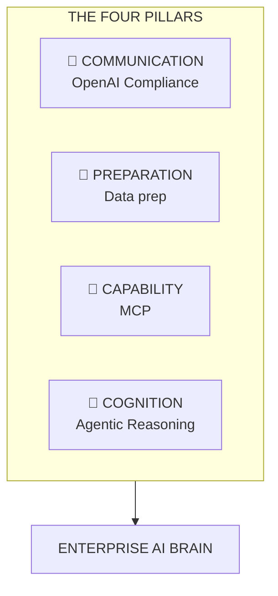
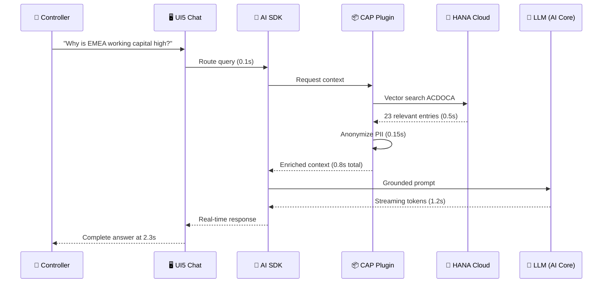
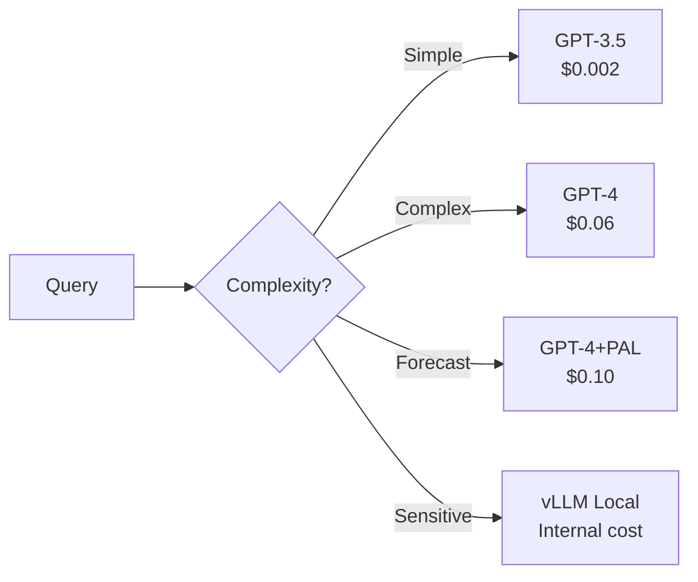

# SAP AI Suite for Finance: Enterprise AI Architecture

**A Concise Summary** — *Version 2.0*

> This document provides an executive overview of the complete architecture. For detailed exploration, see the linked documents in each section.

---

## The Problem: Why Enterprise AI Fails

Finance teams face four critical challenges when adopting Generative AI. These aren't theoretical concerns—they represent real business costs that compound over time, delaying AI adoption and exposing organizations to risk.

The root cause is simple: general-purpose AI tools are not designed for enterprise finance. They lack access to your ACDOCA data, don't understand your company-specific definitions (like how you calculate DSO), and have no guardrails against sending sensitive customer data to external models. The result is a fragmented, risky, and ultimately unsuccessful AI implementation.

| Antagonist | The Problem | Business Cost |
|------------|-------------|---------------|
| **🔀 Fragmentation** | Multiple LLM providers with different APIs | 40% slower development, $50K-200K/year waste |
| **📊 Data Gap** | LLMs lack access to enterprise context (ACDOCA, etc.) | 15-30% hallucinations, 6-12 months to production |
| **🔒 Privacy** | Raw PII sent to external models | GDPR fines up to €20M, SOX compliance failure |
| **⏱ Performance** | Slow responses, UI freeze, poor scalability | 60% task abandonment, 40% lower adoption |

**A Day in the Life:** Sarah, a Controller, needs to answer: *"Why is EMEA working capital high?"* Without the right architecture, she exports data, risks GDPR violations, gets generic answers, and spends 45 minutes—only to miss the CEO's deadline.

*For the full analysis, see [01-enterprise-ai-problem.md](01-enterprise-ai-problem.md).*

---

## The Solution: SAP AI Suite on BTP

A **13-service Ensemble** built on SAP open-source libraries and orchestrated via **SAP AI Core**. This isn't a collection of disconnected tools—it's a unified architecture where each component has a specific role, and together they solve all four enterprise AI challenges.

The architecture follows four foundational patterns that work together as a system. OpenAI Compliance ensures all services speak the same language. data prep prepares data before it ever reaches an LLM. MCP enables intelligent tool discovery. And Agentic reasoning allows the system to handle complex, multi-step tasks autonomously.

| Pattern | Purpose | Business Value |
|---------|---------|----------------|
| **OpenAI Compliance** | All services expose `/v1/chat/completions` | Swap models without code changes |
| **Data prep** | Data sanitization (anonymization, formatting) | Zero PII exposure, higher-quality reasoning |
| **MCP** | Services expose discoverable "Tools" | Autonomous, extensible agents |
| **Agentic** | Plan → Act → Observe → Correct | Self-healing workflows |

*For pattern details and code examples, see [06-architectural-patterns.md](06-architectural-patterns.md).*

---

## The 13 Services (Five Pillars)

The Ensemble is organized into five pillars, each addressing a different layer of the enterprise AI stack. This isn't arbitrary grouping—it reflects how requests flow through the system and how different concerns (user interaction, business logic, data access, performance, and governance) are cleanly separated.

Every service in the Orchestration and Intelligence layers is built on SAP open-source libraries from [github.com/SAP](https://github.com/SAP). This ensures long-term support, security updates, and alignment with SAP's product roadmap.

| Pillar | Services | SAP OSS Repository | Purpose |
|--------|----------|-------------------|---------|
| **Interaction** | UI5 Web Components, OData Vocabularies | [`SAP/ui5-webcomponents-ngx`](https://github.com/SAP/ui5-webcomponents-ngx) | Enterprise chat, semantic standards |
| **Orchestration** | AI SDK JS, CAP LLM Plugin, LangChain | [`SAP/ai-sdk-js`](https://github.com/SAP/ai-sdk-js), [`SAP/cap-llm-plugin`](https://github.com/SAP/cap-llm-plugin) | Model routing, RAG, privacy |
| **Intelligence** | MCP PAL, Data Copilot, GenAI Toolkit | [`SAP/generative-ai-toolkit-for-sap-hana-cloud`](https://github.com/SAP/generative-ai-toolkit-for-sap-hana-cloud) | Forecasting, data quality, ML |
| **Foundation** | Streaming Core, vLLM, data prep, HANA Vector Store | Custom + open source | Performance, search, transformation |
| **Governance** | World Monitor | Custom | Observability, tracing, audit |

*For the complete service catalog, see [04-ensemble-of-services.md](04-ensemble-of-services.md).*

---

## The Request Journey: 2.3 Seconds

Understanding how a request flows through the system reveals why this architecture delivers both speed and security. What looks like a simple chat interaction actually involves coordinated work across multiple services—each optimized for its specific role.

The key insight is parallelization and streaming. We don't wait for the entire response before showing results. The native Streaming Core begins delivering tokens to the user at 1.1 seconds, well before the LLM has finished generating. This "speed of thought" experience is what transforms AI from a batch tool into an interactive assistant.

**What happens in those 2.3 seconds:**
1. **Ingress** — UI5 validates input, attaches user context, establishes SSE connection
2. **Data prep** — CAP plugin queries HANA vectors, anonymizes PII, enriches with OData vocabularies
3. **Discovery** — SDK discovers available MCP tools (PAL forecast, vector search)
4. **Reasoning** — LLM processes grounded prompt via OpenAI-compliant interface
5. **Egress** — Streaming Core delivers tokens in real-time, World Monitor traces everything

*For the complete request flow with timing breakdowns, see [03-ensemble-strategy.md](03-ensemble-strategy.md).*

---

## SAP's Open Source AI Strategy: The Foundation

This architecture directly implements SAP's corporate open-source strategy, as detailed in the **SAP Open Source Report 2025**. When you adopt this architecture, you're not building on a custom framework—you're building on the same foundation that SAP itself is investing in for the long term.

This matters for enterprise customers because it eliminates a common concern: "What happens if the team that built this moves on?" The answer is that SAP's central Open Source Program Office, OpenChain certification, and central OSS fund ensure these libraries will be maintained and improved regardless of individual team changes.

> *"Openness is fundamental to SAP's AI strategy... to ensure our AI creates meaningful, scalable value for our customers."*
> — Dr. Philipp Herzig, CTO of SAP SE

### The Three Pillars of SAP's Strategy

| Pillar | SAP Initiative | Implementation in This Architecture |
|--------|----------------|-------------------------------------|
| **Standardization** | Gold founding member of Agentic AI Foundation (AAIF), contributor to MCP/A2A protocols | MCP tool discovery (Service 5), agentic patterns |
| **Innovation** | Open-sourced `sap-rpt-1-oss` foundation model | vLLM private inference (Service 12) |
| **Infrastructure** | NeoNephos Foundation, Fork Metadata Standard, Central OSS Fund | Kubernetes operators, SBOM transparency via World Monitor |

### Scale of Investment

| Metric | Value |
|--------|-------|
| **Public repositories** | 308+ |
| **Foundation memberships** | 15+ (Eclipse, Cloud Foundry, Linux, AAIF, NeoNephos) |
| **Protocol contributions** | MCP, A2A, Fork Metadata |
| **OpenChain certification** | "Whole entity" ISO/IEC 5230 |

*For the complete strategy analysis, see [07-sap-open-source-ai-strategy.md](07-sap-open-source-ai-strategy.md).*

---

## Key Synergies & Business Value

The architecture's value emerges from how its components work together. Security isn't a single layer—it's defense in depth. Resilience isn't a single failover—it's circuit breakers at multiple levels. Cost optimization isn't a single choice—it's intelligent routing that matches each query to the right model.

### Defense in Depth

Three layers of security ensure that no single failure can compromise user data. XSUAA validates tokens at the network layer. data prep anonymizes PII before it reaches any LLM. And the AI SDK's safety filter catches inappropriate content in real-time.

| Layer | Protection | Component |
|-------|------------|-----------|
| **Network** | XSUAA token validation, role-based access | Streaming Core |
| **Data** | PII masking, data classification | data prep layer |
| **Content** | Harmful content blocking, compliance | AI SDK Safety Filter |

### Resilience Patterns

The system is designed to degrade gracefully rather than fail completely. If Azure OpenAI is down, requests automatically route to the local vLLM instance. If HANA times out, cached context is served with a warning. Users experience a delay, not an error.

| Failure | Detection | Recovery | User Impact |
|---------|-----------|----------|-------------|
| LLM Provider Down | SDK health check | Auto-failover to vLLM | <3s delay |
| HANA Timeout | 5s timeout | Serve cached context | Degraded + warning |
| PII Leak Attempt | data prep detection | Block + alert | Request rejected |

### Cost-Optimized Routing

Not every query needs GPT-4. Simple lookups can use GPT-3.5 at 1/30th the cost. Sensitive queries that can't leave your perimeter route to local vLLM at internal cost only. The AI SDK analyzes each query and routes it to the optimal model based on complexity, sensitivity, and cost.

**Monthly Savings Example:** 10,000 simple + 5,000 complex + 1,000 sensitive queries  
→ **Without routing:** $960 → **With routing:** $320 → **67% reduction**

*For resilience patterns and failure handling, see [03-ensemble-strategy.md](03-ensemble-strategy.md).*

---

## The 13 Services at a Glance

| # | Service | Pillar | SAP Repository | Finance Use Case |
|---|---------|--------|----------------|------------------|
| 1 | UI5 Web Components | Interaction | [`SAP/ui5-webcomponents-ngx`](https://github.com/SAP/ui5-webcomponents-ngx) | Chat dashboard |
| 2 | AI SDK JS | Orchestration | [`SAP/ai-sdk-js`](https://github.com/SAP/ai-sdk-js) | Model routing |
| 3 | CAP LLM Plugin | Orchestration | [`SAP/cap-llm-plugin`](https://github.com/SAP/cap-llm-plugin) | ACDOCA RAG |
| 4 | Streaming Core | Foundation | Custom (streaming) | Real-time delivery |
| 5 | MCP PAL | Intelligence | Custom | Sales forecast |
| 6 | Data Cleaning Copilot | Intelligence | Custom | Data quality audit |
| 7 | HANA Vector Store | Foundation | SAP HANA Cloud | Knowledge search |
| 8 | GenAI Toolkit | Intelligence | [`SAP/generative-ai-toolkit-for-sap-hana-cloud`](https://github.com/SAP/generative-ai-toolkit-for-sap-hana-cloud) | Custom ML |
| 9 | LangChain Integration | Orchestration | [`SAP/langchain-integration-for-sap-hana-cloud`](https://github.com/SAP/langchain-integration-for-sap-hana-cloud) | Vector store |
| 10 | Vocabulary query | Foundation | Custom | Log transformation |
| 11 | OData Vocabularies | Interaction | Custom | Semantic definitions |
| 12 | vLLM | Foundation | vLLM | Private LLM |
| 13 | World Monitor | Governance | Custom | Observability |

---

## Quality & Hardening Summary

Every component in this architecture has been hardened from open-source baseline to enterprise-grade. This means parameterized queries instead of string interpolation, XSUAA integration instead of manual tokens, and chaos-tested resilience instead of happy-path-only operation.

The hardening process follows a systematic three-tier testing strategy: unit tests for new TypeScript types, integration tests for SDK alignment with XSUAA, and chaos engineering for resilience under load. The result is a system that scores 8-9/10 across all enterprise quality attributes.

From OSS to enterprise-grade (based on [05-oss-adaptation-strategy.md](05-oss-adaptation-strategy.md)):

| Attribute | Score | Evidence |
|-----------|-------|----------|
| **Security** | 9/10 | Zero injection vectors, XSUAA integration |
| **Reliability** | 9/10 | Circuit breaker, chaos-tested (1000 concurrent users) |
| **Performance** | 9/10 | <200ms first token, 10K concurrent connections |
| **Maintainability** | 8/10 | TypeScript, 85-90% test coverage |
| **Observability** | 9/10 | End-to-end OpenTelemetry traces |

**Effort Distribution:** 80% reused from OSS, 20% hardening → 6 months saved vs. building from scratch.

*For the complete hardening strategy with code examples, see [05-oss-adaptation-strategy.md](05-oss-adaptation-strategy.md).*

---

## Getting Started

| Audience | Start Here |
|----------|------------|
| **Executives** | [01-enterprise-ai-problem.md](01-enterprise-ai-problem.md) for business value |
| **Architects** | [02-component-mapping.md](02-component-mapping.md) + [06-architectural-patterns.md](06-architectural-patterns.md) |
| **Developers** | [00-glossary.md](00-glossary.md) + [04-ensemble-of-services.md](04-ensemble-of-services.md) |
| **Security** | [05-oss-adaptation-strategy.md](05-oss-adaptation-strategy.md) |

---

## Summary: The Ensemble Advantage

| Capability | How It's Achieved | Business Value |
|------------|-------------------|----------------|
| **Speed** | SSE streaming + SSE | 2.3s response, first token at 1.1s |
| **Accuracy** | HANA RAG + OData vocabularies | No hallucinations, grounded responses |
| **Security** | Defense-in-depth (XSUAA + data prep) | Zero PII exposure |
| **Resilience** | Circuit breaker + failover | 99.9% availability |
| **Cost** | Intelligent model routing | 67% reduction |
| **Future-proof** | SAP open-source strategy alignment | Long-term ecosystem compatibility |

---

*This architecture transforms Sarah's Monday morning from 45 minutes of fragmented work to 2.3 seconds of secure, accurate insight. Built on SAP's 27-year open-source journey, it's an AI foundation you can trust.*

---

**Next:** Explore the full documentation at [github.com/SAP](https://github.com/SAP) and the [SAP Open Source Report 2025](https://d.dam.sap.com/a/CRdeMdL/SAP_Open_Source_Report_2025.pdf).

---

## Related Documents

- **[README.md](README.md)** — Document map and navigation
- **[00-glossary.md](00-glossary.md)** — Terms and definitions
- **[01-enterprise-ai-problem.md](01-enterprise-ai-problem.md)** — The business problems
- **[02-component-mapping.md](02-component-mapping.md)** — Component architecture
- **[03-ensemble-strategy.md](03-ensemble-strategy.md)** — Request flow & resilience
- **[04-ensemble-of-services.md](04-ensemble-of-services.md)** — 13 services deep dive
- **[05-oss-adaptation-strategy.md](05-oss-adaptation-strategy.md)** — OSS hardening
- **[06-architectural-patterns.md](06-architectural-patterns.md)** — Design patterns
- **[07-sap-open-source-ai-strategy.md](07-sap-open-source-ai-strategy.md)** — SAP OSS strategy

---

*Version 2.0 | Updated 2026-02-27*