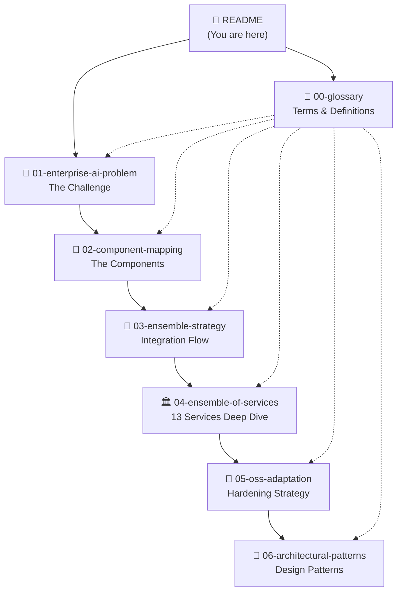
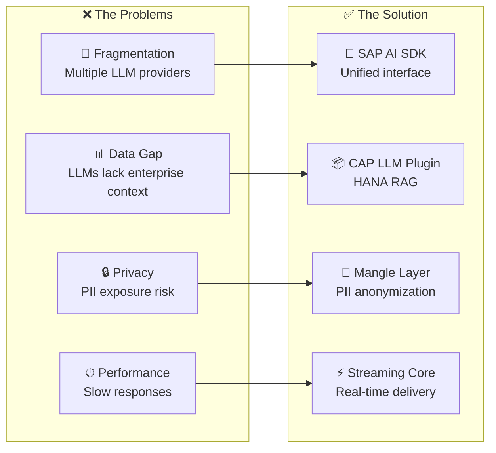

# SAP AI Suite: Enterprise AI Architecture for Finance

> This documentation describes an enterprise AI architecture built on **SAP Open Source libraries** published at [github.com/SAP](https://github.com/SAP) and orchestrated via **SAP AI Core**. The architecture addresses financial accounting, financial management reporting, and controllership use cases.

---

## 📚 Document Map

---

## 📄 Documents & Audiences

| Document | Description | Audience |
|----------|-------------|----------|
| **[00-glossary.md](00-glossary.md)** | Definitions of key terms: Mangle, MCP, PAL, RAG, etc. | 🏢 👩‍💻 🏛 All |
| **[01-enterprise-ai-problem.md](01-enterprise-ai-problem.md)** | The business problems this architecture solves | 🏢 Executives, 🏛 Architects |
| **[02-component-mapping.md](02-component-mapping.md)** | What each component does and why | 🏛 Architects, 👩‍💻 Developers |
| **[03-ensemble-strategy.md](03-ensemble-strategy.md)** | How components integrate and handle failures | 🏛 Architects, 🔐 Security |
| **[04-ensemble-of-services.md](04-ensemble-of-services.md)** | Deep dive into all 13 services | 👩‍💻 Developers, 🏛 Architects |
| **[05-oss-adaptation-strategy.md](05-oss-adaptation-strategy.md)** | How SAP OSS was hardened for enterprise | 👩‍💻 Developers, 🔐 Security |
| **[06-architectural-patterns.md](06-architectural-patterns.md)** | The four patterns: OpenAI, Mangle, MCP, Agentic | 🏛 Architects, 👩‍💻 Developers |
| **[07-sap-open-source-ai-strategy.md](07-sap-open-source-ai-strategy.md)** | SAP's open-source AI strategy: MCP, A2A, AAIF | 🏢 Executives, 🏛 Architects, 👩‍💻 Developers |
| **[08-executive-summary.md](08-executive-summary.md)** | **Concise summary** of the complete architecture | 🏢 Executives, 🏛 Architects |

**Legend:** 🏢 Executives | 👩‍💻 Developers | 🏛 Architects | 🔐 Security Officers

---

## 🎯 What This Architecture Solves

Finance teams face four critical challenges when adopting Generative AI:

---

## 🏗 Technology Stack

This architecture leverages **SAP Open Source libraries** from [github.com/SAP](https://github.com/SAP):

| Component | SAP OSS Repository | Purpose |
|-----------|-------------------|---------|
| AI SDK | `SAP/ai-sdk-js` | Model orchestration, safety, grounding |
| CAP LLM Plugin | `SAP/cap-llm-plugin` | RAG pipeline, PII anonymization |
| UI5 Components | `SAP/ui5-webcomponents-ngx` | Enterprise chat interface |
| HANA Vector | `SAP/langchain-integration-for-sap-hana-cloud` | Vector storage and search |
| GenAI Toolkit | `SAP/generative-ai-toolkit-for-sap-hana-cloud` | HANA ML integration |

**Orchestration:** All components are orchestrated through **SAP AI Core**, SAP's managed AI infrastructure on BTP.

---

## 🚀 Getting Started

### For Executives
Start with **[01-enterprise-ai-problem.md](01-enterprise-ai-problem.md)** to understand the business value, then skim **[03-ensemble-strategy.md](03-ensemble-strategy.md)** for the integration approach.

### For Architects
Read documents in order (01 → 06), focusing on **[02-component-mapping.md](02-component-mapping.md)** for component selection and **[06-architectural-patterns.md](06-architectural-patterns.md)** for design decisions.

### For Developers
Start with **[00-glossary.md](00-glossary.md)** to learn the terminology, then dive into **[04-ensemble-of-services.md](04-ensemble-of-services.md)** for implementation details and **[05-oss-adaptation-strategy.md](05-oss-adaptation-strategy.md)** for code patterns.

---

## 📖 Quick Reference

### The 13 Services (Five Pillars)

| Pillar | Services | Purpose |
|--------|----------|---------|
| **Interaction** | UI5 Web Components, OData Vocabularies | User interface, semantic standards |
| **Orchestration** | AI SDK, CAP LLM Plugin, LangChain | Model routing, RAG, privacy |
| **Intelligence** | MCP PAL, Data Copilot, GenAI Toolkit | Forecasting, data quality, ML |
| **Foundation** | Streaming Core, vLLM, Mangle, HANA Vector Store | Performance, search, transformation |
| **Governance** | World Monitor | Observability, tracing, audit |

### The Four Architectural Patterns

| Pattern | Purpose | See |
|---------|---------|-----|
| **OpenAI Compliance** | Universal API interface | [06-architectural-patterns.md](06-architectural-patterns.md#1-openai-compliance) |
| **Mangle** | Data sanitization | [06-architectural-patterns.md](06-architectural-patterns.md#2-the-mangle-pattern) |
| **MCP** | Tool discovery | [06-architectural-patterns.md](06-architectural-patterns.md#3-mcp-model-context-protocol) |
| **Agentic Reasoning** | Autonomous decisions | [06-architectural-patterns.md](06-architectural-patterns.md#4-agentic-reasoning) |

---

## 📋 Version Information

| Document | Version | Last Updated |
|----------|---------|--------------|
| All documents | 2.0 | 2026-02-27 |

---

*For questions, see the [Glossary](00-glossary.md) or contact the SAP AI Suite team.*